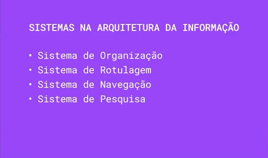

# Sistemas na arquitetura da informação

Essa é uma forma fundamental de decompor a Arquitetura da Informação em seus componentes práticos.Vamos explorar cada um desses sistemas:

## 1. Sistema de Organização:

- **O que é?** O sistema de organização define como o conteúdo é agrupado e estruturado dentro do ambiente de informação. Ele estabelece a arquitetura fundamental, a estrutura e os relacionamentos entre as diferentes partes do conteúdo. É a "espinha dorsal" da informação.
- **Objetivo**: Tornar o conteúdo logicamente acessível e compreensível, permitindo que os usuários encontrem ou que procurem de forma intuitiva.
- **Tipos de Sistemas de Organização**:
  - **Organização Exata**: Baseada em características fixas e bem definidas, como ordem alfabética (listas de produtos, glossários), cronológica (históricos de notícias, blogs), ou geográfica (mapas, diretórios de locais). É útil quando os usuários sabem exatamente o que estão procurando.
  - **Organização Ambígua**: Baseada em características mais subjetivas e interpretativas, como tópico (categorias de um blog, frascos de um site), tarefa (como fazer algo, guias), público-alvo (informações para diferentes tipos de usuários), metáfora (usar conceitos familiares para organizar informações complexas). Requer mais cuidado na definição das categorias para evitar ambiguidades.
  - **Organização Híbrida**: Combina diferentes tipos de organização para atender a diversas necessidades. Por exemplo, um site de comércio eletrônico pode usar categorias por tipo de produto (tópico) e dentro de cada categoria, listar os produtos em ordem alfabética (exata).
- **Considerações**: Ao projetar um sistema de organização, é crucial entender os modelos mentais dos usuários, seus objetivos e a natureza do conteúdo. Testes de usabilidade podem ajudar a validar a eficácia da estrutura escolhida.

É nessa etapa que **desenharemos** as categorias do site

## 2. Sistema de Rotulação:

- **O que é?** O sistema de rotulagem envolve a criação de termos (rótulos) que representam as categorias, os links, os botões e outros elementos de navegação dentro do ambiente de informação. São as palavras que os usuários veem e usam para se orientar.
- **Objetivo**: Comunicar de forma clara e concisa o conteúdo ou a função de cada elemento da interface, facilitando a compreensão e a tomada de decisões dos usuários.
- **Princípios de uma Boa Rotulagem**:
  - **Clareza**: Os rótulos devem ser fáceis de entender e evitar jargões ou termos ambíguos.
  - **Consistência**: Usar os mesmos termos para representar o mesmo conceito em toda a interface.
  - **Concisão**: Preferir rótulos curtos e diretos.
  - \*\*Familiaridade: Usar termos que sejam familiares ao público-alvo.
  - **Contexto**: O significado de um rótulo pode ser influenciado pelo seu contexto.
- **Exemplos**: Nomes de rótulos em um menu de navegação (`"Produtos"`, `"Serviços"`, `"Contato"`), `títulos de páginas, `etiquetas de filtros (`"Cor"`, `"Tamanho"`, `"Preço"`), textos de botões (`"Comprar agora"`, `"Saiba mais"`).

## 3. Sistema de Navegação:

- **O que é?** O sistema de navegação compreende os elementos e mecanismos que permitem aos usuários se movimentarem através do ambiente de informação. Ele define os caminhos pelos quais os usuários podem percorrer para encontrar o conteúdo desejado.
- **Objetivo**: Facilitar a exploração do conteúdo, permitir que os usuários encontrem o que busquem de forma eficiente e ofereçam uma sensação de orientação dentro do sistema.
- **Tipos de Sistemas de Navegação**:
  - **Navegação Global**: Presente em todas as páginas do site ou aplicativo, geralmente inclui o menu principal, links para a página inicial, busca, etc.
  - **Navegação Local**: Específica para uma seção ou página, oferecendo opções de navegação dentro daquele contexto (por exemplo, links relacionados, resumo de um artigo).
  - **Navegação Contextual**: Incorporada diretamente no conteúdo, como hiperlinks dentro de um texto.
  - **Navegação Suplementar**: Elementos que auxiliam a navegação, como breadcrumbs (trilhas de navegação), sitemaps, índices.
- **Considerações**: A estrutura do sistema de organização influencia diretamente o sistema de navegação. É importante garantir que os caminhos de navegação sejam lógicos, intuitivos e que os usuários sempre saibam onde estão e para onde podem ir.

## 4. Sistema de Pesquisa:

- **O que é?** O sistema de pesquisa permite que os usuários obtenham informações específicas no ambiente de informação usando palavras-chave. É uma ferramenta poderosa para encontrar conteúdo quando uma navegação estruturada não é suficiente ou quando o usuário tem uma necessidade específica em mente.
- **Objetivo**: Permitir que os usuários encontrem rapidamente informações relevantes, mesmo em grandes volumes de conteúdo.
- **Componentes de um Sistema de Pesquisa Eficaz**:
  - **Caixa de Busca**: Uma interface clara para inserir os termos de pesquisa.
  - **Algoritmo de Busca**: O mecanismo que processa a consulta e retorna os resultados mais relevantes.
  - **Resultados da Busca**: Apresentação clara e organizada dos resultados, geralmente com títulos, trechos e informações contextuais.
  - **Opções de Filtragem e Refinamento**: Permitem que os usuários limitem os resultados da busca por critérios específicos (dados, categoria, autor, etc.).
- **Considerações**: A eficácia do sistema de pesquisa depende da qualidade do algoritmo, da indexação do conteúdo e das opções de refinamento oferecidas aos usuários. Uma boa rotulagem e taxonomia também sensíveis para resultados de busca mais precisos.

### A Interdependência dos Sistemas:

É fundamental entender que esses quatro sistemas não funcionam isoladamente. Eles estão interconectados e se influenciam mutuamente. Uma boa Arquitetura da Informação considera a integração desses sistemas para criar uma experiência de usuário coesa e eficaz.

- Uma **organização** clara facilita a criação de rótulos significativos e a definição de caminhos de **navegação** intuitivos.
- Um bom sistema de **rotulagem** melhora a eficácia da navegação e da **pesquisa** .
- Um sistema de **navegaçã**o bem estruturado que complementa a **organização** e oferece alternativas à **pesquisa** .
- Um sistema de **pesquisa** eficiente pode compensar deficiências nos sistemas de **organização** e **navegação** , mas idealmente, todos devem trabalhar em conjunto.

- ### [Voltar ao Menu - Criando a experiência de navegação de um ambiente digital](../menu.md)
