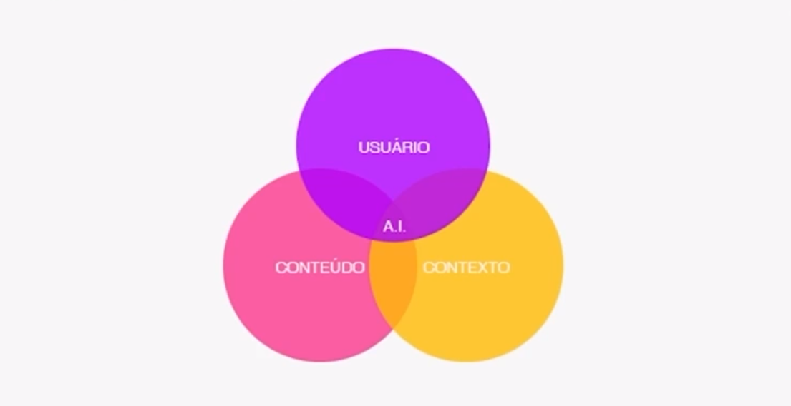
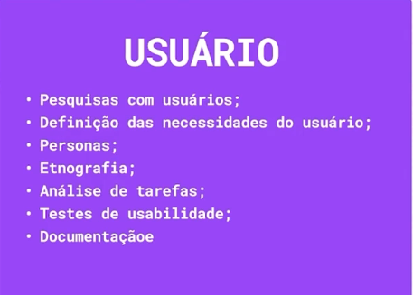
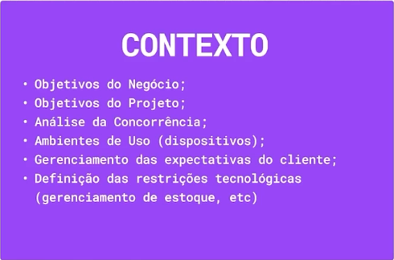

# A Tríade da Arquitetura da Informação

A base da **Aruitetura da Informação** contém uma tríade que compõe o pensamento a (AI): **Usuário, Contexto e Conteúdo**.Ela é considerada um dos pilares fundamentais da disciplina e nos ajuda a entender a complexidade envolvida na organização da informação. Vamos explorar cada um desses elementos:

## 1. Usuário (User):

- **Quem são?** Este elemento é referente às pessoas que irão interagir com o sistema de informação que estamos projetando. É crucial entender suas necessidades, objetivos, comportamentos, conhecimentos prévios, modelos mentais, habilidades e limitações.
- **Por que é importante?** A IA focada no usuário busca criar sistemas que sejam intuitivos, simples de usar e que atendam às necessidades informacionais do público-alvo. Sem compreender o usuário, corremos o risco de construir algo que ninguém consegue ou quer usar.
- **O que considerar?**
  - **Pesquisa de usuários**: Entrevistas, questionários, testes de usabilidade, análise de dados de uso.
  - **Personas**: Criação de representações fictícias dos usuários típicos para guiar o design.
  - **Jornada do usuário**: Mapeamento das etapas que o usuário percorre ao interagir com o sistema.
  - **Acessibilidade**: Garantir que o sistema seja utilizável por pessoas com diferentes habilidades.

## 2. Contexto (Contexto):

- **Onde e como a informação será utilizada?** O contexto abrange o ambiente em que o usuário interage com a informação. Isso inclui fatores como o dispositivo utilizado (desktop, celular, tablet), a localização física, o momento de uso, as tarefas que o usuário está realizando, a cultura organizacional (se aplicável), as restrições técnicas e de negócios.
- **Por que é importante?** O contexto molda as expectativas e necessidades do usuário. Uma informação organizada de forma eficaz em um contexto pode ser confusa ou inconveniente em outro.
- **O que considerar?**
  - **Análise do ambiente**: Compreender as condições técnicas, sociais, culturais e organizacionais.
  - **Requisitos de negócio**: Alinhar a AI com os objetivos estratégicos da organização.
  - **Restrições técnicas**: Considerar as limitações da plataforma ou sistema.
  - **Fluxo de trabalho**: Entender como a informação se encaixa nos processos de trabalho do usuário.

## 3. Conteúdo (Conteúdo):

- **Qual é a informação?** Consulte dados, textos, imagens, vídeos, áudios e outros tipos de informação que o sistema contém. Isso inclui sua estrutura, formato, volume, atualização, relevância e precisão.
- **Por que é importante?** O conteúdo é o cerne do sistema de informação. Uma IA eficaz organiza o conteúdo de forma lógica, clara e acessível, facilitando sua localização, compreensão e uso.
- **O que considerar?**
  - **Inventário de conteúdo**: Catalogação e análise do conteúdo existente.
  - **Modelagem de conteúdo**: Definição da estrutura e dos relacionamentos entre os diferentes tipos de conteúdo.
  - **Taxonomia e vocabulário controlado**: Criação de sistemas de classificação e termos padronizados para facilitar a busca e a navegação.
  - **Arquitetura da informação**: Organização e estruturação do conteúdo para melhorar a usabilidade e a encontrabilidade.

## A Interconexão da Tríade:

É crucial entender que esses três elementos não existem isoladamente. Eles estão intrinsecamente ligados e se influenciam mutuamente. Uma boa Arquitetura da Informação considera o equilíbrio e a interação entre o usuário, o contexto e o conteúdo.

- **As necessidades do usuário (Usuário) em um determinado momento e lugar (Contexto) determinam o tipo de informação (Conteúdo) que ele precisa e como essa informação deve ser organizada e apresentada.**
- **As características do conteúdo (Conteúdo) podem influenciar a forma como a interação do usuário com o sistema (Usuário) em um determinado contexto (Contexto).**
- **As restrições do contexto (Contexto) podem impactar tanto o tipo de conteúdo que pode ser oferecido (Conteúdo) quanto a forma como ele é apresentado ao usuário (Usuário).**

- ### [Voltar ao Menu - Criando a experiência de navegação de um ambiente digital](../menu.md)
