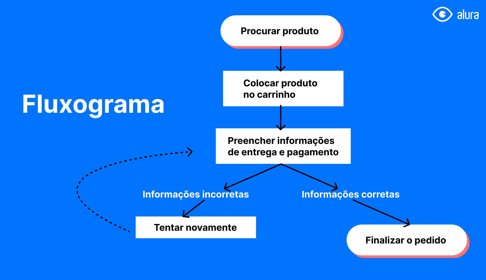
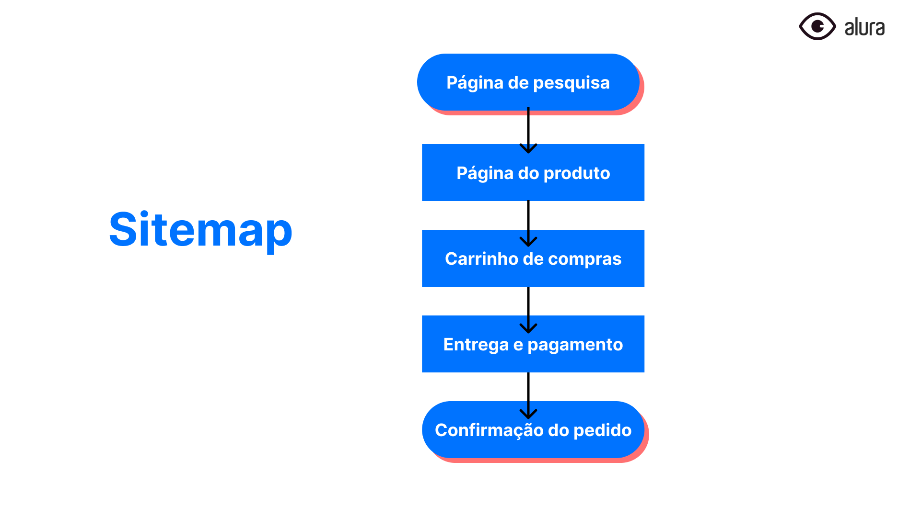
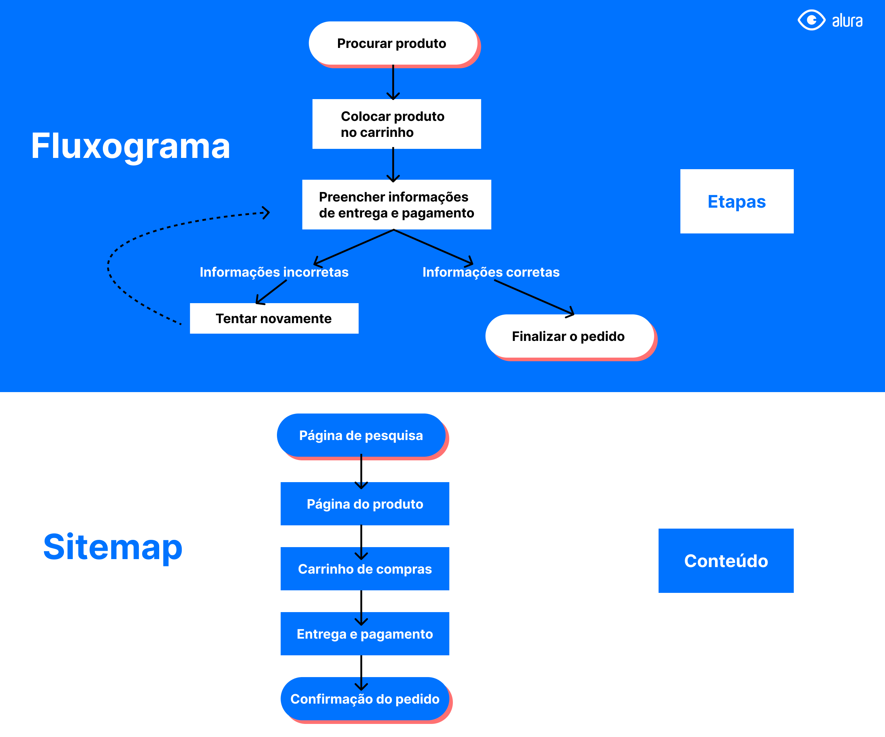

# Sitemap X Fluxograma

Uma das principais dúvidas que surgem ao iniciar os estudos sobre entregáveis dentro da área de Arquitetura da Informação é sobre a diferença entre Fluxograma e Sitemap, conhecido como Mapa do Site ou Mapa de Navegação em português.

Apesar de trabalharem de forma muito semelhante, com um foco muito grande em fluxos dentro de sites e aplicativos, esses entregáveis possuem particularidades próprias e atacam diferentes tipos de problemas.

O fluxograma é uma representação visual de um processo, descrevendo etapa por etapa que ocorre dentro de um produto, serviço ou até mesmo em um sistema. Geralmente pode ser utilizado para definir ações a serem tomadas pelas pessoas usuárias, por exemplo: para concluir uma compra a pessoa pesquisa pelo produto, coloca-o no carrinho, preenche as informações de entrega e pagamento, e finaliza o pedido.

Já o sitemap faz um estudo dos conteúdos dentro de um site ou aplicativo, mostrando a ordem deles e suas ligações. Esse entregável pode ser utilizado para estruturar os produtos digitais, visando trazer a melhor organização para as funcionalidades e para o conteúdo. Por exemplo: para que seja possível realizar compras será necessário uma página de pesquisa, uma página com o produto, um carrinho de compras, uma tela para preencher as informações de entrega e pagamento, e uma última interface com a confirmação do pedido e dados gerais.

Enquanto o fluxograma tem um foco maior em descrever as etapas que alguém precisa realizar para concluir uma ação, o sitemap descreve o conteúdo que o site ou aplicativo precisa oferecer para que esses processos sejam possíveis de acontecer. Cada um tem o seu próprio objetivo, mas juntos podem se complementar!

### [Voltar ao Menu - Arquitetura da Informação: projetando para dispositivos móveis e e-commerces](../menu.md)
