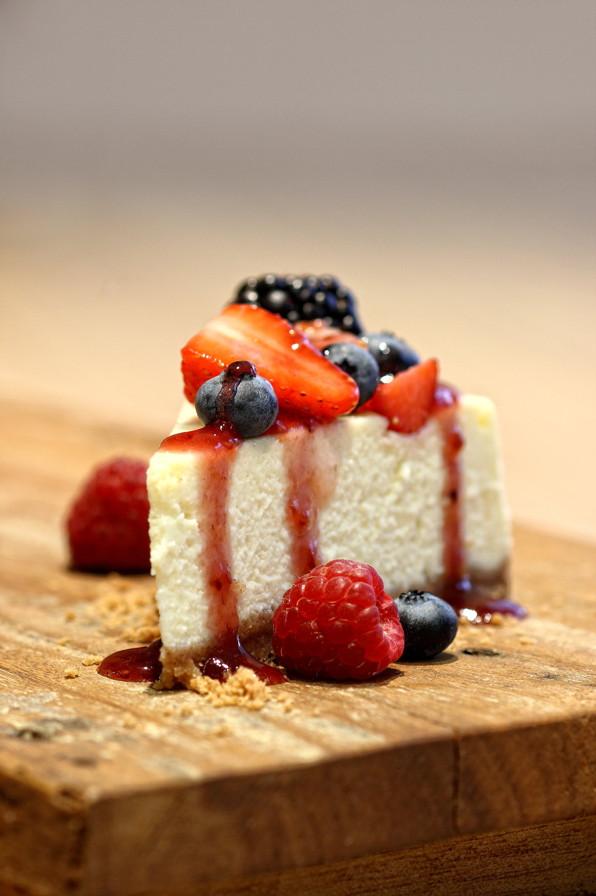

# Blend modes

Os blend modes (modos de mesclagem,) ou ainda layer modes, mesclam os pixels de uma camada ativa (ou superior) aos das camadas imediatamente abaixo. Para isso, o GIMP realiza cálculos matemáticos para promover a interação desejada. Na versão atual do software, a 2.10.20, existem 38 opções de modos que estão agrupados em sete categorias, da seguinte maneira:

1. **Normal**: Não gera alterações.

2. **Clareamento**: A combinação vai gerar um resultado mais claro que a camada original. Os pixels brancos e tons próximos ficam transparentes.

3. **Escurecimento**: Aqui haverá o escurecimento da composição, com os pixels pretos e tons próximos se tornando transparentes.

4. **Contraste**: De um modo geral, os pixels cinzas ficam transparentes e o resultado é uma imagem com mais contraste em suas cores e iluminação.

5. **Inversão**: O software procura por variações entre a camada ativa e as de baixo para criar a mesclagem.

6. **Componentes HSV**: Para cada modo deste grupo um componente HSV - Hue (Matiz), Saturation (Saturação) e Value (Brilho) - é retirado do primeiro plano, enquanto que os outros dois componentes do segundo plano (camada de baixo). Por exemplo, se o modo Hue for escolhido, o resultado será o matiz em questão combinado com a saturação e o brilho dos pixels da camada de baixo. O mesmo processo vale para os outros dois componentes.

7. **Componentes LCH**: A sigla LCH significa Lightness, Chroma, Hue, em inglês e pode ser traduzida como Brilho, Croma, Matiz. Estes modos são úteis para reparar as cores de uma imagem e funcionam de maneira similar aos Componentes HSV, mas com resultados um pouco menos saturados.

**Screen** - clareamento

Tudo que for preto vai desaparecer, enquanto que o branco puro vai continuar como estava e os meio tons entre preto e branco se tornarão mais claros. Modo indicado para, além de clarear, também trazer uma certa tonalidade de outra cor. Opacidade da camada roxa em 25%.

No caso da Baking, podemos incorporar o roxo da identidade nas fotografias para criar um filtro suave sobre as imagens dos produtos. O que acha?

**Multiply** - escurecimento

Uma das melhores maneiras para escurecimento. Esse modo de mesclagem é o oposto do Screen: ele multiplica o brilho dos pixels da camada superior (neste caso o degradê) com os da camada inferior. Neste caso, tudo que for multiplicado por preto preto - cujo valor de brilho é zero - será escurecido. Funciona muito bem para criar sombras e remover brancos e outras cores claras.

**Burn** - escurecimento

Se você quer escurecer ainda mais a imagem, o burn é uma opção. Os tons médios ficam mais saturados e a luminosidade diminui. A opacidade da camada do degradê fica em 30%, para o efeito não ficar exagerado.

Note como o cheesecake ganhou em dramaticidade. É preciso cuidado para não haver desequilíbrio, principalmente nas partes mais escuras da imagem, neste caso, a madeira da mesa. Lembre-se do que conversamos quando conhecíamos o Histogram e avalie se talvez poderíamos suavizar o efeito com uma máscara de camada para o degradê ou ainda retrabalhando sua opacidade.

**Overlay** - contraste

Usa uma combinação dos blend modes Screen e Multiply: aplica uma multiplicação pela metade desses modos e os meio tons (cinza 50%) ficam transparentes. Como resultado, há um efeito de realce no contraste geral da imagem. A opacidade da camada roxa fica em 80%.

Observe como este filtro de roxo é mais proeminente do que o gerado pelo Screen, em razão do modo agir tanto sobre os pixels claros quanto escuros. Mais uma vez, é preciso ter atenção quanto à intensidade para a ação para que não fique exagerada.

### [Menu - GIMP: edição e tratamento de imagens para identidade visual](menu.md)