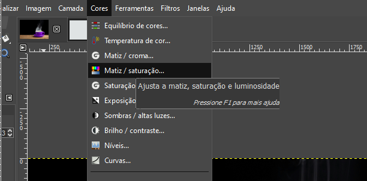
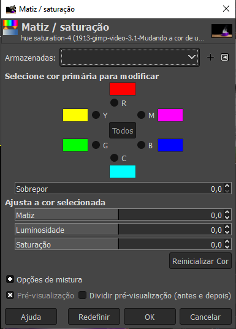

# Mudando a cor de um elemento

Muita atenção pois essas mudanças são destrutivas, fazer uma cópiado elemento.

1. #### Criar uma nova camada, ou fazer uma cópia da camada atual

2. **Fazer uma selação do elemento**: Pode se usar o `path`, ou outro modo que achar mais adequado.

3. Em `Cores` acessar `Matiz/Saturação`

- Uma nova aba se abrirá:

- Selecionar a cor primária para o ajuste

- Na janelinha fazer o ajuste até a cor desejada.

### [Menu - GIMP: edição e tratamento de imagens para identidade visual](menu.md)