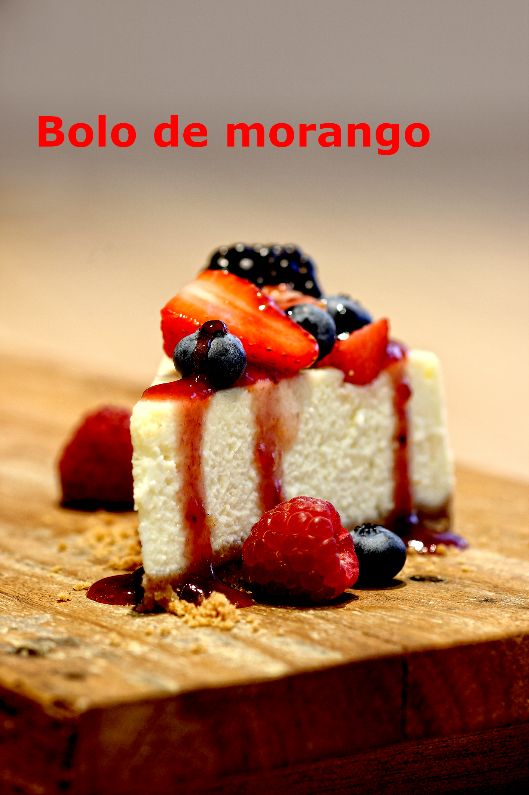
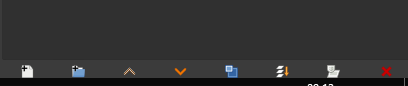
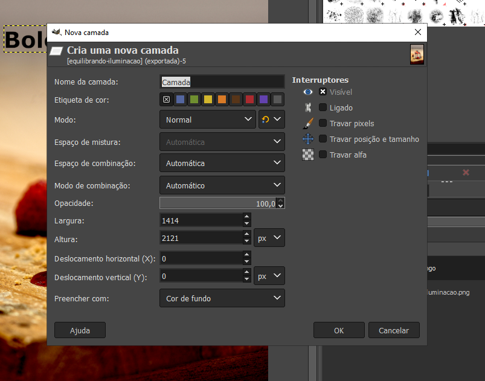
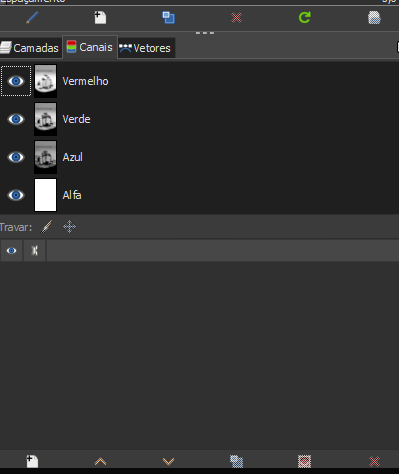
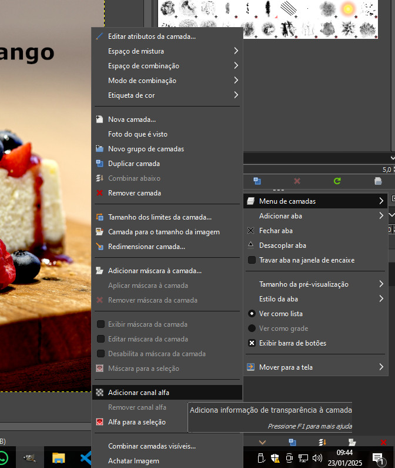

# Básico do Funcionamento

Existem alguns conceitos importantes que precisamos nos familiarizar:

## Noção de transparência

O primeiro desses conceitos é a **noção de transparência**. 

Vamos concordar que ao criar uma camada nova com texto, essa camada está acima da camada imagem-bolo, mas eu consigo ainda enxergar a foto do bolo em si, porque a camada texto não é totalmente preenchida, só tem o preenchimento onde está o texto mesmo, "Bolo de Morango".

Tanto que se eu chamar a ferramenta de movimentação, a Move Tool, tecla “M” é o atalho, e andar com o texto, eu continuo vendo a fotografia do sanduíche normalmente, só ficam escondidas as partes que estão atrás do texto.

Isso é muito importante, porque vai me permitir criar camadas distintas sem necessariamente de sempre esconder o que está abaixo. E vamos criar então uma camada nova e pintá-la de uma cor.

### Novas Camadas

Para eu criar uma camada nova eu preciso vir aqui embaixo, neste iconezinho de uma folhinha com o mais, 

de create new layer. Cliquei aqui, ele vai abrir esse painel para mim de camada nova e tem uma série de atributos que eu posso definir.

Nesse primeiro momento vamos só nos concentrar neste aqui, “Fill with”, ou seja, preencher com, e eu tenho algumas opções de preenchimento, “Foreground color”, “Background color”, “White”, “Transparency” e “Pattern”. White é branco, transparency é transparência e pattern é uma padronagem.

Importante nesse primeiro momento para nós é foreground color e background color. O que significa isso? Foreground color é a cor do primeiro plano, background color a cor do plano de trás, do fundo.

Mas o que seria esse primeiro plano e esse segundo plano, esse fundo? São estas duas cores que nós vemos nesses quadradinhos. A cor do foreground color, a cor que vai ser ativa para pintarmos, por exemplo, uma camada, é essa que está na esquerda acima, a camada preta.

A camada do fundo, a background color, é a camada que está branca. Então vou pintar a minha camada nova com a foreground color, então selecione aqui, vou dar o ok e olha o que aconteceu, eu estou com uma camada preta acima de todas as outras, eu não estou conseguindo ver o que está atrás.

Mas vimos que essas camadas podem ter transparência, então o que eu posso fazer? Essa camada é um conteúdo distinto em relação às outras, então as alterações que eu fizer nesta camada vão ficar restritas a essa camada.

Uma alteração que eu posso fazer, por exemplo, é apagar parte dela, então vou chamar a ferramenta borracha que tem esse iconezinho, “Shift + E” é o atalho, chamei-a e mudei o meu cursor, eu posso definir nas propriedades da ferramenta o tamanho dela, em “Size”. Eu tenho um tamanho aqui já bem grande, de 718, se clicar aqui e arrastar, eu diminuo, olha o que aconteceu com meu cursor, ou aumento de novo, aumentei o cursor.

Vou agora clicar e ir apagando partes desta camada preta. Agora eu consigo enxergar o que estava abaixo, por quê? Porque essas camadas têm a propriedade de mostrar transparência.

E na miniatura dessa camada você repare que eu tenho um quadriculadozinho de tons de cinza e a parte preta. Esse quadriculado vai sempre me indicar a noção de transparência. Se eu enxergar esse quadriculado na tela, na minha prancheta de trabalho, eu vou ter uma área transparente.

Se eu tiver uma área transparente que nem nessa camada que criamos e por trás outra camada, aí eu não vou ver o quadriculado. Mas se eu esconder a camada texto e a camada sanduíche, olha o que eu estou enxergando aqui, o quadriculado. Então esta camada só tem cor nesta parte de baixo preta, no resto dela ela está transparente.

Isso é muito importante – chamei as minhas camadas de volta – porque eu consigo trabalhar com os conteúdos sem destruir outros, então eu apaguei parte da camada preta, mas você repare que a camada de texto e a camada da imagem do sanduíche continuam intactas. Então vou chamar aqui a ferramenta Move Tool de novo, vou clicar sobre a camada de texto sanduíche e vou movimentar o texto para cima.

Mas nem sempre as camadas já têm essa propriedade de transparência. Como nós conferimos a propriedade de transparência?

A imagem que nós estamos trabalhando utiliza o modo de cores RGB. O modo de cores RGB trabalha com as cores de luz vermelha, verde e azul, red, green e blue em inglês, afinal de contas, estamos trabalhando num monitor de um computador, de um smartphone, enfim, e essa informação é exposta como luz, a mistura de uma luz vermelha, verde e azul produz as cores que nós estamos vendo em tela.

Se viermos aqui em “Channels”, canais, logo ao lado de “Layers”, essa abinha, e clicarmos nela, vamos ver que temos quatro canais, “Red”, “Green”, “Blue”, ou seja, vermelho, verde e azul, que são as misturas de cores, e outro canal aqui chamado “Alpha”. Esse canal Alpha é que vai conferir a propriedade de transparência, ou seja, de eu conseguir enxergar esse fundo transparente.

## Criando camada Alpha

Em Layers (camadas), clicar com o meu botão direito do mouse e vou ir em “Add Alpha Channel”, adicionar o canal Alpha, para assim ter uma manipulação mais livre da imagem, tanto que se agora eu vier e apagar parte desta imagem, agora sim eu estou vendo o fundo transparente, não estou vendo um fundo colorido com a cor do background.

## Mudar o tema de visualização do GIMP

Ir em “Edit”, “Preferences”, preferências, e clicar, ele vai me dar um menuzinho flutuante e ir em “Interface” e “Theme”, ou tema. E você repare que o tema que está selecionado é o escuro, o “Dark”, vou trocar, por exemplo, para o “Light”, olha o que vai acontecer, agora o meu GIMP está com uma cor diferente.

### [Menu - GIMP: edição e tratamento de imagens para identidade visual](menu.md)