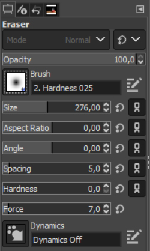
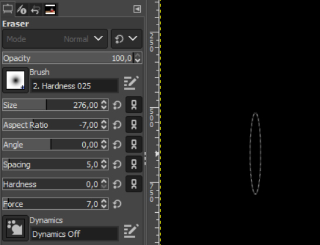
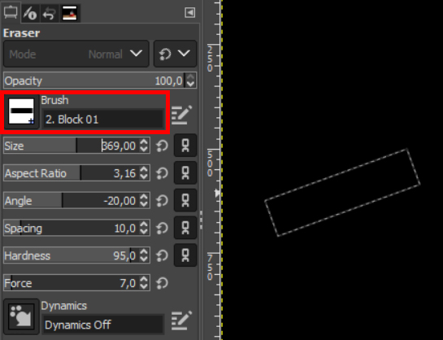
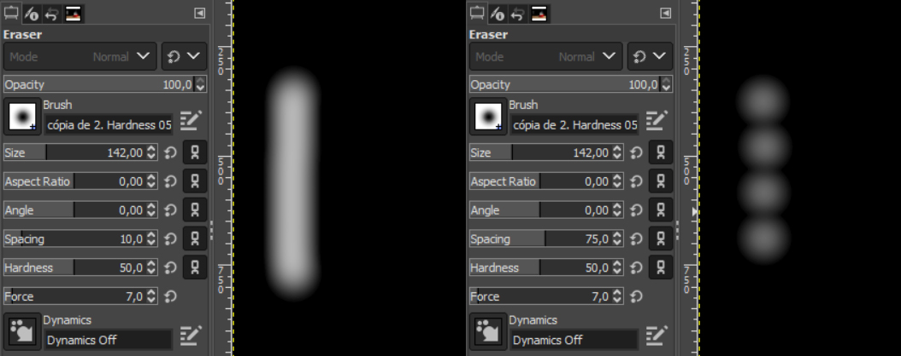

# Configurações de borracha

A borracha, como observamos em aula, é a ferramenta básica para apagar partes de uma camada no GIMP. Ela possui um determinado formato conforme o tipo de brush (pincel) selecionado. Por padrão, ele é redondo, mas pode ser alterado no menu contido na barra de opções da ferramenta. Além disso, há outros parâmetros de configuração para a borracha:

- **Size**: controla o tamanho do pincel. Os atalhos para aumentá-lo e diminuí-lo são colchete para direita e esquerda, respectivamente.

- **Aspect Ratio**: define uma determinada relação de proporção entre largura e altura do pincel. Automaticamente ela é de 1x1 e é indicada pelo valor 0. Diminui-la reduzirá a largura do pincel, deixando-o mais verticalizado; aumentá-la reduzirá a altura, fazendo com que ele fique mais horizontalizado.

Valores negativos para o aspect ratio do pincel.

- **Angle**: é a angulação do pincel. No caso de elipses esse valor não tem relevância, mas em outros objetos vai modificar a orientação do pincel em relação ao eixo X (horizontal).

Pincel com outro formato e angulação modificada.

- **Spacing**: estabelece o espaçamento entre a unidade do pincel quando ele for utilizado de forma contínua, isto é, clicando e segurando o mouse.

O valor de 10 fez com que a ação contínua do pincel gerasse uma forma única. Já com 75 conseguimos identificar os pincéis individualmente.

- **Hardness**: é a dureza das bordas do pincel. Quanto maior, mais definidas elas serão. Durezas menores fazem com que as bordas sejam desfocadas e a transição entre figura e fundo seja mais suave.

- **Force**: trata da força necessária para executar a ação completa com o pincel. Valores menores implicarão em maiores comandos sobre a ferramenta para que ela apague totalmente uma dada área.

### [Menu - GIMP: edição e tratamento de imagens para identidade visual](menu.md)