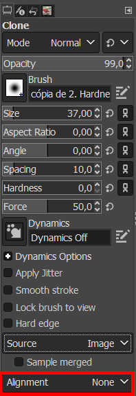
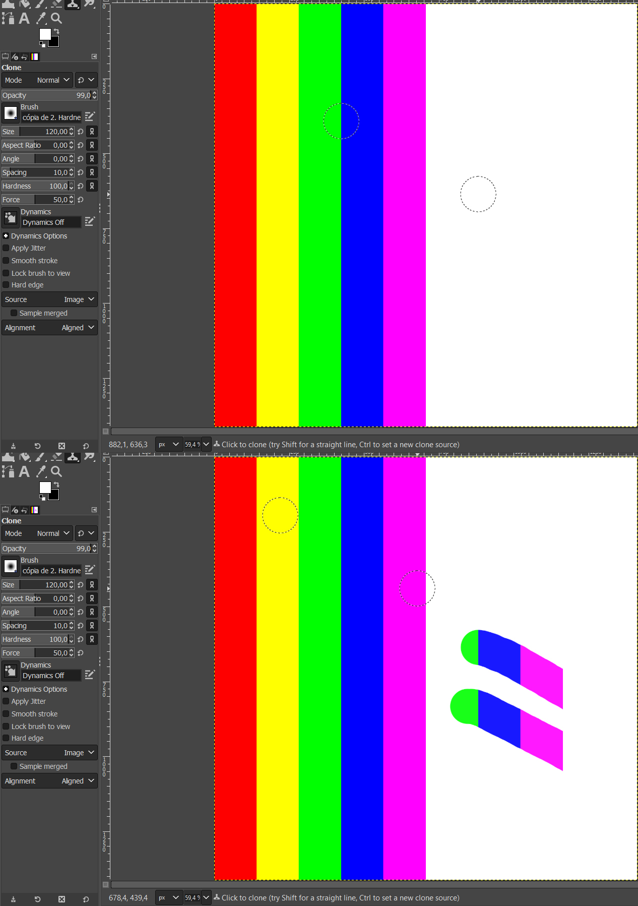
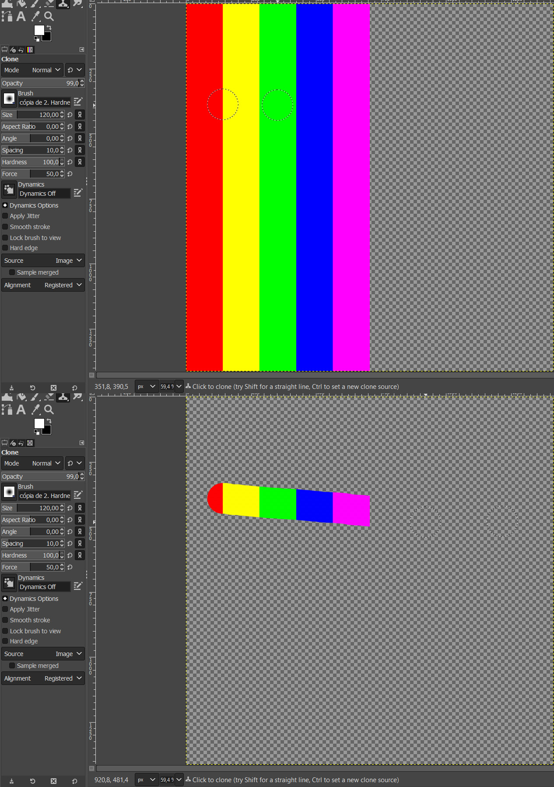
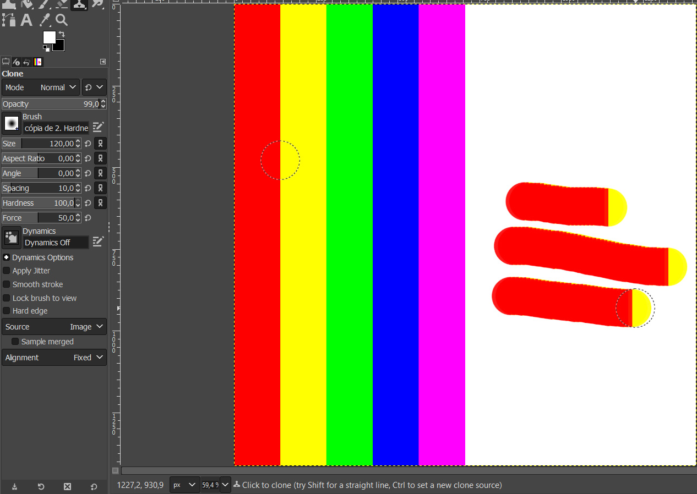

# Configurações de clonagem

A ferramenta Clone permite a cópia de partes da imagem por meio da definição de uma referência (ou origem). Assim como todas as outras ferramentas no GIMP, ela possui uma barra de propriedades para configuração dos seus parâmetros de ação. O pincel que vai executar a clonagem compartilha os mesmo atributos dos demais que nós já experimentamos durante o curso: Size, Aspect Ratio, Angle, Spacing, Hardness e Force. Além destes, ele tem também outros, particularmente importantes para a clonagem, dentro da caixa Alignment, que tratam como será o comportamento do pincel:

- **None**: As pinceladas são tratadas de maneira independente entre si. Para cada pincelada, o ponto de referência é copiado conforme o deslocamento do pincel e as pinceladas podem passar umas por cima das outras. É o que utilizamos em aula.

- **Aligned**: Aqui, o primeiro clique que você fizer definirá o espaçamento entre a fonte de origem e o resultado clonado e todas as pinceladas seguintes usarão esta distância. Além disso, você pode usar quantas pinceladas quiser e todas elas irão se misturar suavemente entre si. Se desejar mudar o espaçamento, selecione uma nova origem (mesmo que seja no mesmo ponto) clicando com o mouse com a tecla Control pressionada.

Para cada nova pincelada, a referência continua a usar o mesmo espaçamento que a primeira pincelada. Então, não existe nenhum espaçamento de clonagem para a primeira pincelada. Aqui, para as pinceladas seguintes, a origem termina fora da tela da imagem de origem, por isso o aspecto cortado.

- **Registered**: Permite que seja registrado um ponto de referência numa camada e o mesmo seja aproveitado em outra camada para realizar a clonagem.

A camada selecionada como referência tem parte transparente. Note como eu aproveitei as cores da camada de referência na camada nova. Atenção: os pixels clonados da referência serão posicionados nas mesmas coordenadas que estavam na sua camada de origem.

- **Fixed**: Nesta opção a origem fica fixa: ela não se move conforme a ação de clonagem for executada.

### [Menu - GIMP: edição e tratamento de imagens para identidade visual](menu.md)