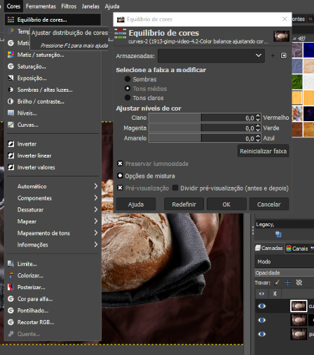

# Color balance: Ajustando cores

O Color Balance (Balanço de Cores) é outra ferramenta essencial no GIMP para ajustar as cores de uma imagem, permitindo corrigir dominâncias de cor indesejadas ou criar efeitos estilizados.  Enquanto as Curvas oferecem um controle mais granular sobre os tons, o Color Balance é mais direto para ajustes gerais de cor.

## Como funciona:

O Color Balance trabalha dividindo a imagem em três faixas de tons: Sombras (tons escuros), Meios-tons (tons médios) e Realces (tons claros). Para cada faixa, você pode ajustar a quantidade de três pares de cores complementares:

- **Ciano ↔ Vermelho**
- **Magenta ↔ Verde**
- **Amarelo ↔ Azul**

Ao aumentar a quantidade de uma cor, você diminui automaticamente sua complementar.  Por exemplo, aumentar o Ciano nas Sombras fará com que elas fiquem mais azuladas, enquanto aumentar o Vermelho nas Sombras as deixará mais avermelhadas.

## Ajustando as cores:

1. **Selecione a faixa de tons**: Comece escolhendo qual faixa de tons você quer ajustar: Sombras, Meios-tons ou Realces.

2. **Ajuste as cores**: Deslize os controles para ajustar a quantidade de cada cor.  Movendo o controle para a direita, você aumenta a cor; movendo para a esquerda, você aumenta sua complementar.

3. **Preservar Luminosidade**: A opção "Preservar Luminosidade" é importante. Se marcada, ela impede que as alterações de cor afetem o brilho geral da imagem. Geralmente, é bom deixá-la marcada para evitar mudanças drásticas na luminosidade.

## Usos comuns:

- **Correção de dominância de cor**: Se uma foto tiver um tom amarelado, por exemplo, você pode reduzir o Amarelo nos Meios-tons e Realces para neutralizar essa dominância.
- **Ajuste de баланço de branco**: Em fotos com iluminação inadequada, o Color Balance pode ajudar a ajustar o баланço de branco, tornando as cores mais naturais.
- **Efeitos criativos**: Você pode usar o Color Balance para criar efeitos estilizados, como tons mais quentes ou mais frios.

## Dicas:

- Comece com ajustes sutis e observe o efeito na imagem.
- Ajuste as cores separadamente para cada faixa de tons para obter um controle mais preciso.
- Use a ferramenta de visualização para comparar a imagem original com a ajustada.
- Experimente diferentes combinações de cores para obter resultados variados.

## Recursos adicionais:

- **Documentação oficial do GIMP**: Procure por "Color Balance" na documentação do GIMP para obter informações detalhadas.
- **Tutoriais em vídeo**: Busque por tutoriais de "Color Balance GIMP" no YouTube para ver exemplos práticos de uso.

O Color Balance é uma ferramenta poderosa quando usada com cuidado.  Experimente bastante para se familiarizar com seu funcionamento e descobrir como ela pode melhorar suas imagens!

### [Menu - GIMP: edição e tratamento de imagens para identidade visual](menu.md)