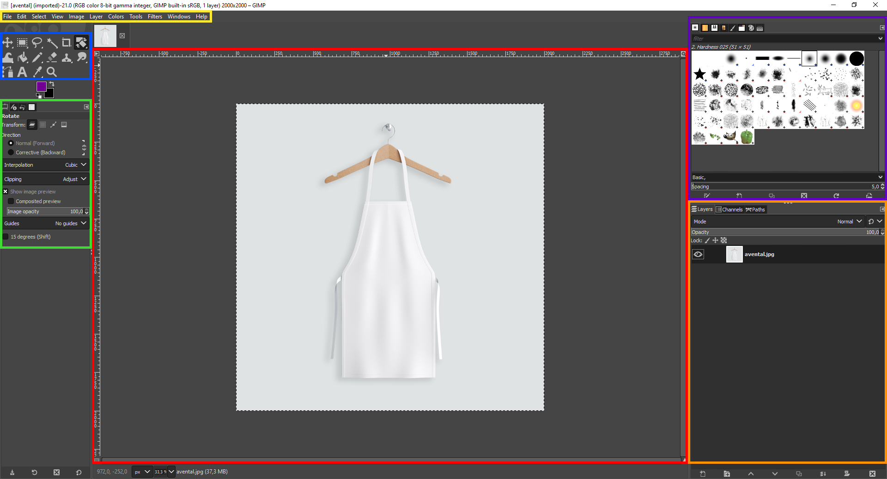
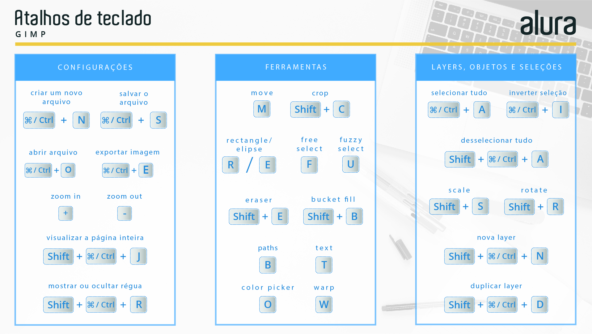

# O layout

São seis áreas principais:

- **Vermelha** - ***Prancheta de trabalho***: local no qual se desenrolam todas as ações do arquivo, como edições, tratamentos e criação de elementos gráficos: eles precisam aparecer na prancheta para estarem visíveis no momento em que o trabalho for exportado como imagem.

- **Azul** - ***Barra de ferramentas***: é onde estão as ferramentas mais populares que alteram o seu mouse. Elas atuam criando novas camadas ou trabalhando naquelas que já existem, das mais diferentes maneiras. Além destas, há outras na aba Tools do software.

- **Verde** - ***Opções da ferramenta***: são os parâmetros a serem ajustados para a ação da ferramenta selecionada. Em algumas ferramentas certos parâmetros só podem ser configurados antes da ação, enquanto que em outras o ajuste é livre.

- **Laranja** - ***Painel de layers, channels e paths***: aqui estão as layers, os canais e os paths do seu arquivo. Eles existem de maneira independente entre si e podem ser editados sem alterar os demais. Mas lembre-se: eles se combinam para gerar o resultado que você vê em tela. Logo, modificar um deles pode impactar na composição como um todo, mesmo que os outros elementos, individualmente, permaneçam inalterados.

- **Roxa** - ***Pincéis, padronagens e gradientes***: são as opções de configurações destas funcionalidades.

- **Amarela** - ***Opções do software***: onde estão todas as ações e configurações possíveis de serem realizadas e reguladas no GIMP.

## Configurações de usabilidade

- **Cor de tema**: Por padrão, o GIMP vem com o layout escuro. Se desejar alterá-lo, acesse Edit > Preferences > Interface > Theme.

- **Ícones das ferramentas**: As ferramentas também podem ser exibidas com ícones diferentes do que os que estou utilizando. Para modificá-los, o caminho é Edit > Preferences > Interface > Icon Theme.

- **Dimensões do novo arquivo**: Ao criarmos um novo arquivo é solicitado, na janela de opções, que digamos as dimensões que ele vai ter. Nessa janela, as dimensões sugeridas sempre serão as mesmas e elas podem ser definidas em Edit > Preferences > Default Image.

- **Limites da camada ativa**: A camada que estamos trabalhando tem seus limites indicados por uma linha pontilhada de amarelo e preto que contorna o seu conteúdo. Caso queira desabilitar essa visualização, vá em View e desmarque o X em Show Layer Boundary.

- **Pesquisa**: Está procurando sem sucesso alguma funcionalidade, ferramenta ou ajuste? Digite a tecla barra / com o teclado e pesquise na janela de diálogo o que você quer.

## Atalhos

Para finalizar o nosso primeiro contato com o GIMP, vou deixar aqui uma imagem com alguns dos atalhos mais úteis para agilizar o seu fluxo de trabalho.

### [Menu - GIMP: edição e tratamento de imagens para identidade visual](menu.md)