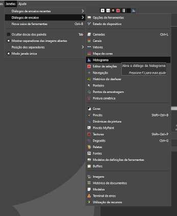
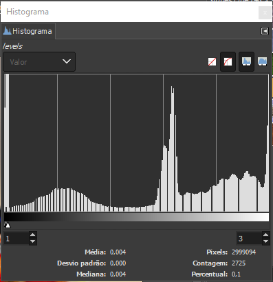
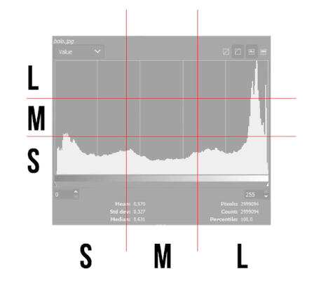
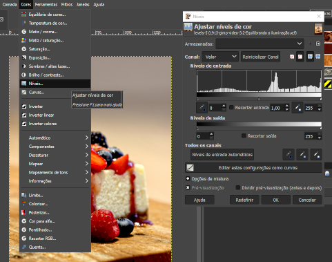
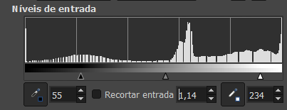

# Equilibrando a iluminação de imagens diferentes

Outro aspecto interessante que temos que ter atenção, que diz respeito a iluminação das fotografias.

Por meio de uma ferramenta do GIMP, podemos conferir se de fato uma imagem tem mais luminosidade do que a outra. E que ferramenta é essa? Ela tem o nome de **histogram**. Vamos ver onde ela está.

- **"`Windows`"(`janela`) -  “`Dockable Dialogs`”(`diálogos encaixáveis`)**:

Dentro de `Dockable Dialogs` eu temos aqui embaixo o “`Histogram`”. E clicando nele, ele vai abrir originalmente na minha janelinha do painel do lado direito, basta clicar e arrastar, como ele é dockable, encaixável, eu podemos tirá-lo daqui e aumentá-lo um pouco, porque ficou pequenininho demais. E temos um gráfico aqui. As informações nele são divididas em três quadrantes, tanto horizontalmente quanto verticalmente.

- **Da esquerda para a direita como de baixo para cima**: temos primeiro um quadrante com informações de sombra, depois informações de meio tons e informações de luz, ou seja, sombra é o escuro total até o meio termo, que é o meio tom, e a iluminação é o branco total, o mesmo vale de baixo para cima. Sombras, meio tons e iluminação. E quanto mais eu tiver o preenchimento nesses quadrantes, mais de sombra e mais de iluminação eu vou ter.

## Ajustando intervalos de Valores

Para ajustar o equilibrio entre luz e sombra de uma imagem podemos usar a ferramenta `Input Levels`

- **`“Colors”`(`cores`) - `“Levels”`(`Níveis`)**

No `input levels`: 
- **0 para as áreas de sombra** 
- **1 para as áreas de meio tons** 
- **255 para as áreas de iluminação**

### O que significa isso? 

- No modo de cores RGB, o **valor 0** indica ausência total de luz, então vamos ter a sombra total. 
- Enquanto que o **255** indica o máximo de luz possível, então vamos ter o branco total. 

Da forma que está a entrada de iluminação dessa imagem, está 0 no input e 0 na saída, então o que é preto está saindo como preto total.

### [Menu - GIMP: edição e tratamento de imagens para identidade visual](menu.md)