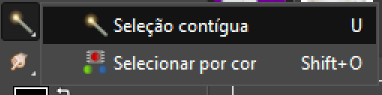

# Ferramentas de Seleção Automáticas

As ferramentas de **seleção automática** se encontram ao lado da de **seleção manual**, a principal delas é a **Fuzzy Select**, mas temos uma associada, conforme aquele triangulozinho no canto inferior esquerdo indica, temos a “**Fuzzy Select**” e também a “**Select by Color**”. Vamos ver como elas funcionam.

A ferramenta de seleção automática precisa de uma informação inicial para dar ao GIMP para, aí sim, ele fazer a seleção. O cursor dessa ferramenta tem um pequeno alvo, é a partir dessa indicação de um ponto específico da imagem que ele vai fazer a seleção, porque o GIMP não sabe o que é fundo e o que é "a imagem", ele enxerga a imagem a partir das cores dos pixels.

### [Menu - GIMP: edição e tratamento de imagens para identidade visual](menu.md)