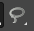
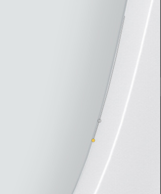

# Ferramentas de Seleção Manual

Um conceito muito importante dentro do GIMP, **é o de seleções**, vamos ver como fazê-las e o que elas são.

As seleções se dividem em dois grupos básicos dentro do software, nas **seleções manuais**, que conforme o nome já indica, são feitas manualmente, nós desenhamos o que queremos selecionar, e as **seleções automáticas**, que são feitas a partir de uma informação inicial que damos para o GIMP e ele trabalha sozinho e faz a seleção, como já diz o nome, automaticamente.

Essas ferramentas se encontram em cima, na barra do lado esquerdo, e essa primeira, a ferramenta **retângulo**, esta segunda, a ferramenta **“Free Selection”**, são as de seleção manual, vamos desenhar o que queremos selecionar. Enquanto que esta terceira, a **“Fuzzy Selection Tool”**, é a de **seleção automática**. Vamos ver como elas funcionam.

## Ferramenta retângulo
 

A **ferramenta retângulo**, o atalho para ela é a tecla “`R`”, ao clicar nela você repare que o menuzinho do lado esquerdo mudou. Você vai ver também que junto ao ícone da ferramenta retângulo tem um pequeno triângulo no canto inferior direito, indicando que eu tenho uma ferramenta associada a ela, e se eu clicar e segurar com o botão esquerdo do mouse, eu vou ver que eu não tenho só a **ferramenta retângulo** no atalho tecla “`R`”, eu tenho a **ferramenta elipse** também na tecla “`E`”.

Ao selecionar a ferramenta retângulo, repare que mouse altera o formato, indicando que é uma ferramenta para se utilizar com o mouse, então ao clicar, segurar e vamos desenhando manualmente uma forma.

Como é uma ferramenta retângulo, essa forma tem os cantos retos. Pode ser tanto um retângulo quanto um quadrado se segurar o “Shift”. Se eu soltar o “Shift”, vamos fazendo um desenho à mão livre, um retângulo. Basta segurar o “Shift” e fazer um quadrado.

Nada aconteceu na imagem, por quê? Porque eu desenhamos a seleção, depois temos que dizer para o GIMP o que eu queremos fazer com essa seleção. E essa seleção está ativa aqui, então eu temos uma linha pontilhada se mexendo em volta dela, em preto e branco, diferente da linha pontilhada em amarelo e preto, que indica a camada que está selecionada.

Com a seleção ativa temos quadrantes internos dentro dessa forma que, conforme vamos andando, eles vão ficando amarelos. Esses quadrantes são indicações de ajustes que podemos fazer desse desenho que acabamos de desenhar. 

Para apagar de fato esta área na imagem. Com a camada avental selecionada e ir na tecla “**Delete**” no teclado e deletar a área, apagar essas informações que estavam dentro da área de seleção da camada. A seleção foi feita. Como eu posso desfazer essa seleção? Não desfazer a ação, desfazer a seleção. “`Ctrl + Shift + A`”, desfaz a seleção.

Ou eu ir em cima, em “`Select`”, e eu temos a opção de “`None`”, ou seja, nenhuma, que é desfazer a seleção, “`Ctrl + Shift + A`”. 

### Outros ajustes da seleção

- **Feather edges (enevoar bordas)**: suavização da seleção, não só dos cantos, da seleção como um todo;
    - 

- **Rounded corners (cantos arredondados)**: Nesse caso  não teremos uma suavização do apagar como um todo, mas só dos cantos desse objeto geométrico;
    - 

## Ferramenta Elípse

Contém as mesmas funcionalidades que a ferramenta retângulo.

## Free Select Tool 

Ela vai funcionar a partir de um desenho feito de pontos em pontos, de clique em clique dentro do GIMP.

- `Backspace`: volta para o clique anterior;
- **Voltar ao ponto inicial**: para fechar a seleção;

Caso seja necessário, **inverter a seleção** `Ctrl + I`. Ou, no menu “**Select**” e eu temos a opção “**Invert**”.

## Modos de seleção

No **Modos de Seleção**, podemos selecionar o modo que queremos que a funcionalidade trabalhe:

- **Substituir a seleção atual**
- **Adicinar a seleção atual `Shift`**
- **Subtrair da seleção atual `Ctrk`**
- **Fazer intesecção da seleção atual `Shift + Ctrl`**

### [Menu - GIMP: edição e tratamento de imagens para identidade visual](menu.md)