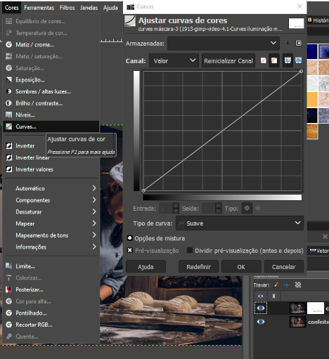

# Curves: Iluminação mais refinada

A ferramenta de Curvas no GIMP é uma das mais poderosas e versáteis para ajustar cores, tons e contraste em suas imagens. Ela oferece um controle preciso sobre a distribuição de tons, permitindo desde correções sutis até efeitos mais dramáticos.

## Como funciona:

A interface da ferramenta Curvas exibe um gráfico com uma linha diagonal (inicialmente reta) que representa a relação entre os tons de entrada (na imagem original) e os tons de saída (após o ajuste). Ao modificar essa curva, você altera como os tons são mapeados, afetando o brilho, contraste e as cores da imagem.

- `Colors`(Cores) - `Curves` (curvas)

## Principais ajustes:

1. **Contraste**: Ao curvar a linha para cima na parte central, você aumenta o contraste, clareando os tons claros e escurecendo os tons escuros. O oposto (curvar para baixo) diminui o contraste.

2. **Brilho**: Deslocar a curva para cima clareia a imagem como um todo, enquanto deslocá-la para baixo a escurece.

3.  **Tons médios**: Ao ajustar a curva na área central, você afeta principalmente os tons médios da imagem, que são os mais comuns.

4. **Sombras e realces**: As extremidades da curva controlam as sombras (tons escuros) e os realces (tons claros), permitindo ajustá-los separadamente.

5. **Canais de cores**: Você pode ajustar as curvas individualmente para cada canal de cor (vermelho, verde e azul), permitindo corrigir баланço de cores e adicionar efeitos criativos.

## Dicas:

- Comece com ajustes sutis e observe o efeito na imagem.
- Experimente diferentes formas de curva para obter resultados variados.
- Use a ferramenta de visualização para comparar a imagem original com a ajustada.
- Você pode salvar suas curvas favoritas para usar em outras imagens.

## Tutoriais:

Para aprender mais sobre o uso das Curvas no GIMP, você pode consultar os seguintes recursos:

- **Documentação oficial do GIMP**: [[URL inválido removido]]([URL inválido removido])
- **Tutoriais em vídeo**:
https://www.youtube.com/watch?v=xN17vbY1a_Q
https://www.youtube.com/watch?v=YU-ktQHBMdU

### [Menu - GIMP: edição e tratamento de imagens para identidade visual](menu.md)