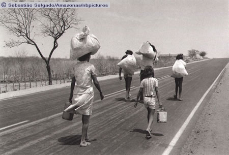

# Imagens em preto e branco

Imagens em preto e branco têm grande valor estético. Não à toa diversos fotógrafos se especializaram em trabalhar com este estilo, como o multipremiado brasileiro **Sebastião Salgado** e o lendário norte americano **Ansel Adams**. A dramaticidade, o ar de mistério, a noção de emergência, dentre muitos outros aspectos podem ser explorados por imagens assim.

Embora os grandes fotógrafos já capturem a imagem em preto e branco, é possível converter cliques originalmente coloridos, como fizemos em aula. Seja qual for a técnica utilizada para a criação do resultado, é importante estar atento a três características importantíssimas da composição em preto e branco:

## 1. Sombras

As sombras aqui não são apenas uma parte da imagem, mas são protagonistas de maior valor. Elas é que vão conferir o clima geral da fotografia, em conjunto com os brancos e o contraste decorrente dessa relação. As sombras, importante lembrar, não precisam ser totalmente pretas para que sejam imponentes.

## 2. Contraste

O contraste vai além da diferença acentuada entre tons: tem um componente de proximidade. Um degradê de preto para o branco tem contraste, mas como a transição das cores é gradual a marcação da tal diferença não é tão acentuada quanto a imagem abaixo, por exemplo.

Fotografia The Tetons and the Snake River (1942), de Ansel Adams. Crédito: National Archives and Records Administration.

O contraste não precisa ser muito destacado: pelo contrário, ele pode ser suave. Cabe a você julgar a mensagem que deseja transmitir. Fotografia Migração Rural para as Grandes Cidades, de Sebastião Salgado. Crédito: Sebastião Salgado.

## 3. Tons

Brilho, escuros e tons de cinza são elementos muito relevantes numa imagem preta e branca. Assim como o contraste, eles podem ser um mensageiro poderoso para a sua cena.

Note como nesta outra fotografia de Ansel Adams, intitulada Evening, McDonald Lake, Glacier National Park (1942) há um clima de mistério e frio. Crédito: National Archives and Records Administration.

Já nesta fotografia, "Grand Teton" National Park, Wyoming há uma sensação maior de leveza e felicidade. As emoções que uma imagem podem despertar decorrem da interpretação em tons de cinza das cores originais.

### [Menu - GIMP: edição e tratamento de imagens para identidade visual](menu.md)