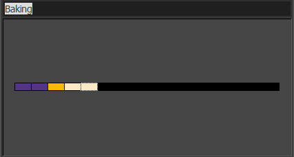
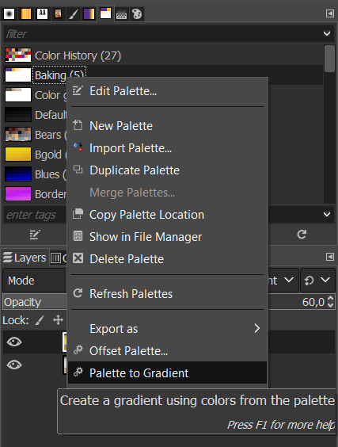
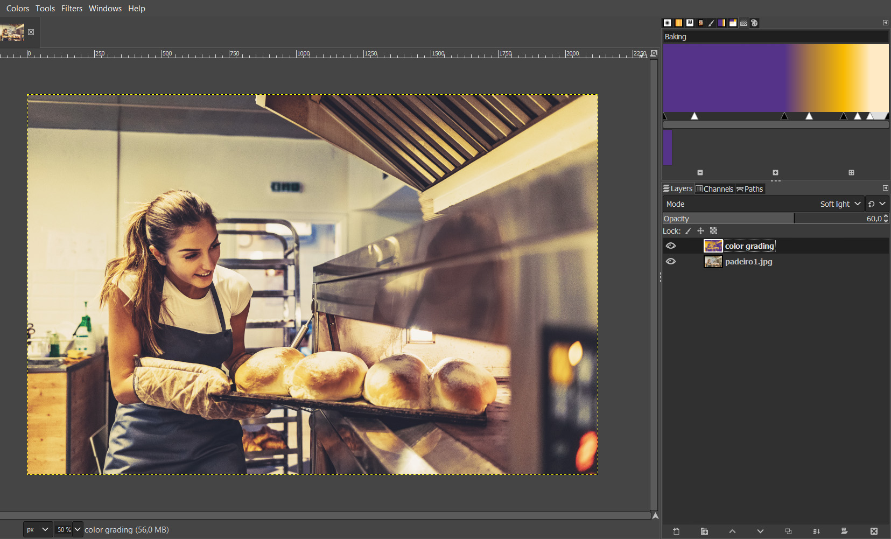
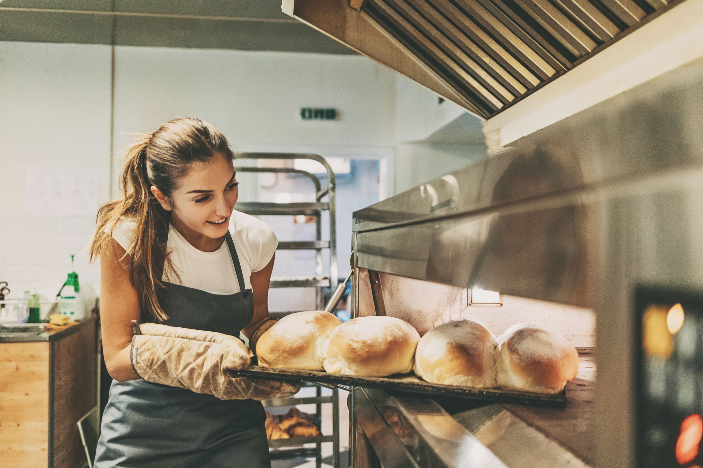
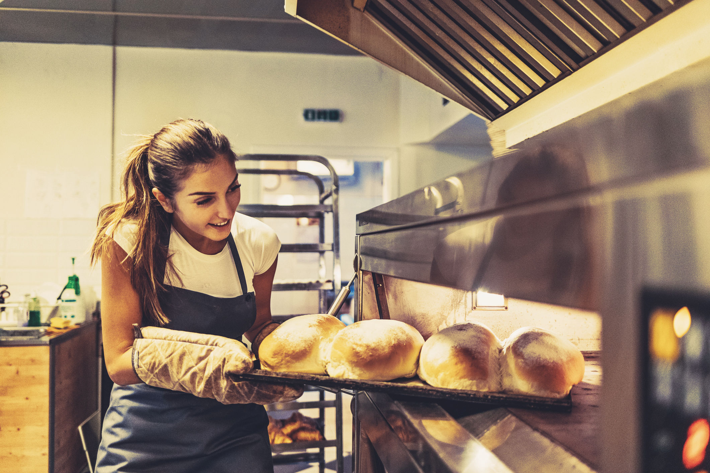

# A importância do color grading

O ***color grading*** é um processo muito importante em materiais visuais e é extensamente usado em fotografias, vídeos e filmes. E por que não em imagens de uma identidade visual? O objetivo é explorar as cores de uma imagem e criar um estilo único. Contraste, cor, saturação, detalhes, nível de preto e branco são alguns dos parâmetros que você pode trabalhar neste processo.

As cores ajudam a contar uma história, montar um clima e contribuem para a transmissão de uma mensagem. Muito comum na indústria cinematográfica, o processo que realizamos em aula agrega técnicas que vão trabalhar de maneira relativamente simples a forma como você pode ajustar as imagens, para que possam compartilhar o mesmo visual. No cinema, este é um assunto extremamente relevante e compreende pesadas edições. No nosso caso, porém, estamos tratando de manter a unidade e definir um estilo.

Você pode, então, tanto aproveitar o ***color grading*** já existente, como fizemos em aula, ou ainda criar o seu. Vamos ver como fazer isso?

O processo é o mesmo para aproveitar os três principais de uma dada fotografia, mas neste caso vamos criar a paleta de cores. Aproveitei o roxo, o amarelo e o amarelo claro da identidade visual, duplicando o primeiro e o último respectivamente para ter cinco amostras na paleta e o degradê ser mais suave.

A paleta de cores da Baking com três tons, sendo os relativos à sombras e luzes duplicados.

Na sequência, clicando sobre a paleta de cores, criamos o degradê em Palette to Gradient.

O degradê criado será o color grading da nossa composição.

Para aplicá-lo sobre a imagem, não esqueça de mantê-lo selecionado na aba Gradients e executar a ação Colors > Map > Gradient Map.

É importante lembrar de tomar atitudes não destrutivas e criar uma camada específica para o mapa de gradiente, como fiz. Além disso, será preciso alterar o blend mode da camada de ajuste. Como queremos realçar o contraste das cores, recomendo o Soft Light com uma redução na opacidade (neste caso está em 60%).

#### Antes e depois

Imagem original, sem o color grading.

Imagem ajustada. Repare como os tons de amarelo e roxo são bem mais visíveis.

### [Menu - GIMP: edição e tratamento de imagens para identidade visual](menu.md)