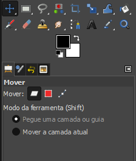
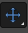
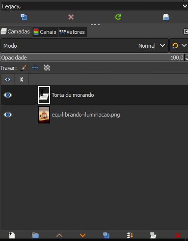

# Introdução ao GIMP

O **GIMP** (GNU Image Manipulation Program) é um software **gratuito e de código aberto** que se tornou um dos principais concorrentes de editores de imagem profissionais como o Photoshop. Ele oferece uma vasta gama de ferramentas para **manipulação de imagens, criação de gráficos e retoque fotográfico**.

## Básico do Funcionamento

- **Abrir Imagens**: `Ctrl + 0` ou ir `File` + `Open`

    - Ou arrastar a imagem do Explorador de Arquivos.

### Painel Ferramentas

### Opções particulares dessa ferramenta

Do lado esquerdo, além das ferramentas em si, cada uma delas tem um ícone, eu tenho a barra de opções particular dessa ferramenta. Repare que na ferramenta Move Tool temos determinados parâmetros, configurações específicas dessa ferramenta. 

-  **move**: para mover os elementos;

-  **ferramenta de texto**: no momento em que eu clicarmos nela essas configurações vão mudar, e vamos editar as configurações da maneira que quisermos e executar a ação.

## O Painel de Camadas do GIMP: A Base da Edição Não Destrutiva

O painel de camadas é um dos elementos mais importantes do GIMP, e entender suas funcionalidades é crucial para dominar a edição de imagens no programa. Ele funciona como um "sanduíche" visual, onde cada fatia representa uma camada individual da sua imagem.

### O que é uma camada?

Imagine que você está pintando um quadro. Cada camada é como uma folha de papel transparente que você coloca sobre a tela. Você pode pintar em cada folha individualmente, sem afetar as outras. No GIMP, as camadas funcionam da mesma forma: você pode adicionar, remover, duplicar, modificar e organizar as camadas para criar efeitos complexos e editar sua imagem de forma não destrutiva.

### Funcionalidades Principais do Painel de Camadas:

- **Visualização**: O painel mostra uma miniatura de cada camada, indicando sua opacidade, modo de mesclagem e nome.
- **Organização**: Você pode renomear, reorganizar, duplicar e excluir camadas. Além disso, é possível criar grupos de camadas para melhor organização.
- **Opacidade**: Ajuste a transparência de cada camada para - **criar efeitos de sobreposição.
Modos de Mesclagem: Escolha como as camadas se misturam entre si, criando efeitos como multiplicar, sobrepor, tela, etc.
- **Máscaras de Camada**: Crie áreas transparentes dentro de uma camada para revelar as camadas abaixo.
Canais: Cada camada pode ter canais de cores (RGB, CMYK) e um canal alfa (transparência).
- **Bloqueio de Camadas**: Impede que você faça alterações acidentais em uma camada específica.

### Por que as camadas são tão importantes?

- **Edição não destrutiva**: Ao trabalhar em camadas, você pode fazer alterações sem afetar a imagem original. Isso significa que você pode voltar atrás e fazer ajustes a qualquer momento.
- **Flexibilidade**: As camadas permitem criar composições complexas, combinar diferentes elementos e experimentar com diversos efeitos.
Organização: Mantendo suas camadas bem organizadas, você facilita a edição e a manutenção de seus projetos.

### [Menu - GIMP: edição e tratamento de imagens para identidade visual](menu.md)