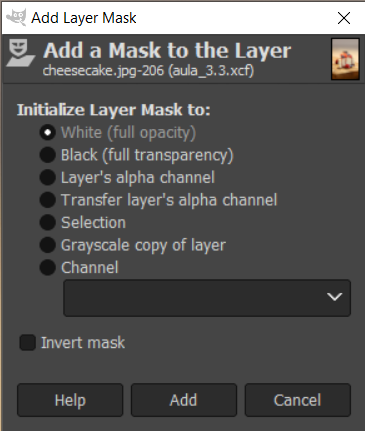
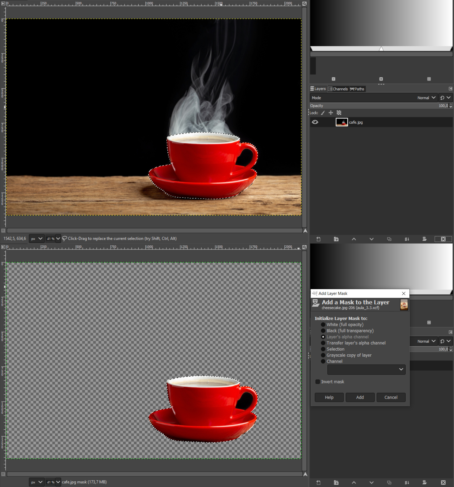
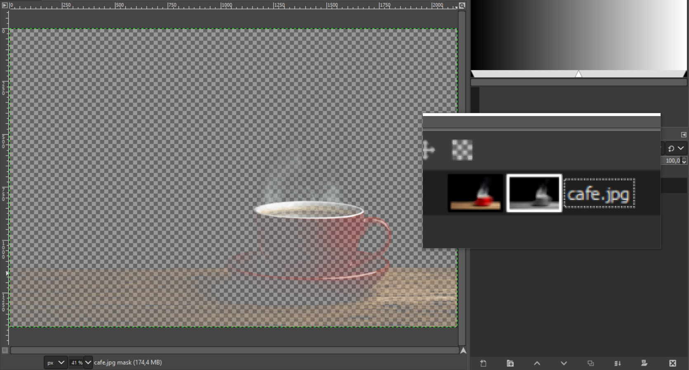
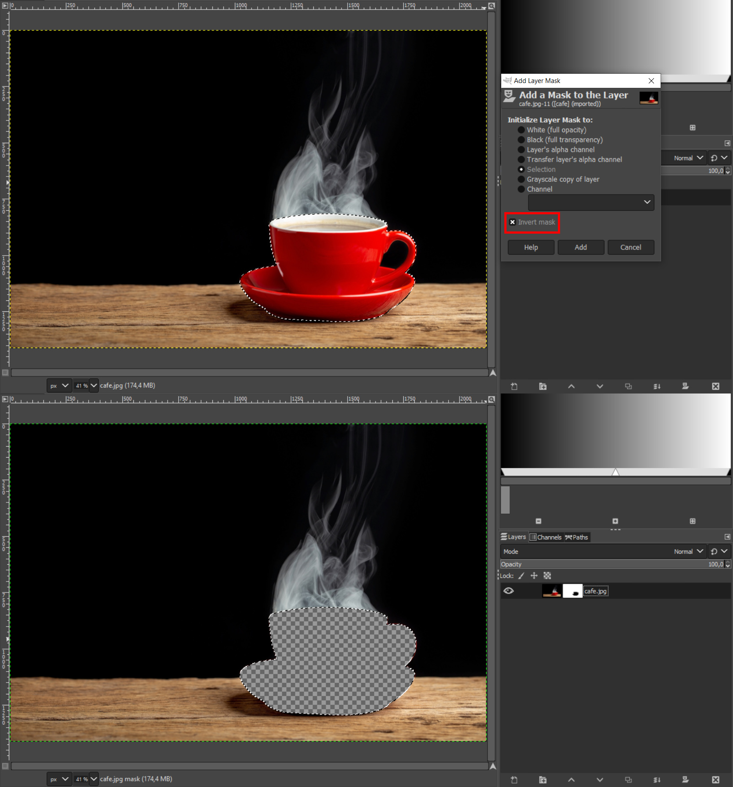

# Layer Mask

As **layer masks** (máscaras de camada) são recursos essenciais para que tomemos atitudes não destrutivas no GIMP. Por meio delas preservamos os pixels e as informações originais da camada e podemos, por exemplo, esconder partes de uma imagem sem deletá-las permanentemente. Para isso, a layer mask utiliza um método de representação baseado em informações brancas e pretas: tudo que estiver branco na máscara será visível na camada original, enquanto que o preto indica que a parcela em questão da camada está escondida. É possível ainda usar o cinza, que vai esconder parcialmente o conteúdo.

Para criar uma nova layer mask é necessário clicar com o botão direito do mouse sobre a camada e escolher Add Layer Mask..., assim é mostrado um menu flutuante com opções de configuração da máscara em Initialize Layer Mask to:

## As configurações definem:

- **White (full opacity)**: a máscara criada não esconderá nada da camada original; por isso a cor branca, que é a indicação de que as áreas estão visíveis. Assim, pode-se esconder as partes que desejar da camada.

- **Black (full transparency)**: é o inverso do branco: a camada original terá seu conteúdo todo escondido e o trabalho se dá trazendo-o de volta. Para isso, é importante lembrar de que a cor do foreground utilizado na ferramenta deve ser preta.

- **Layer's alpha channel**: neste modo a máscara é gerada conforme existir ou não o canal alfa da camada: se ele existir a máscara será branca, se não, será preta.

- **Selection**: aqui a máscara é criada a partir de uma seleção desenhada.

A área que estiver dentro da seleção será mantida visível e as demais escondidas.

- **Grayscale**: a máscara será criada em tons de cinza a partir da camada original, escondendo parcialmente as informações conforme mais escuras elas forem.

- **Channel**: desta forma ela será formada a partir de um dos canais vermelho, verde ou azul (do modo de cores RGB) da sua imagem.

Assim como as seleções, em que nós podemos inverter a área selecionada, o mesmo é possível com as máscaras:

A opção **Invert mask** inverte as áreas visíveis e escondidas.

### [Menu - GIMP: edição e tratamento de imagens para identidade visual](menu.md)