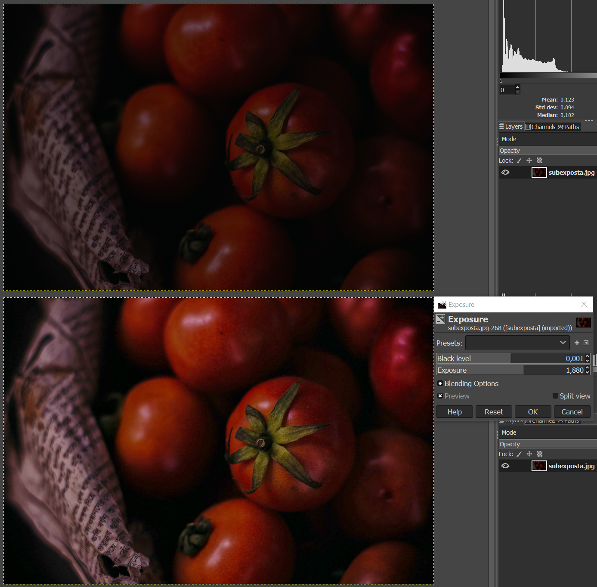
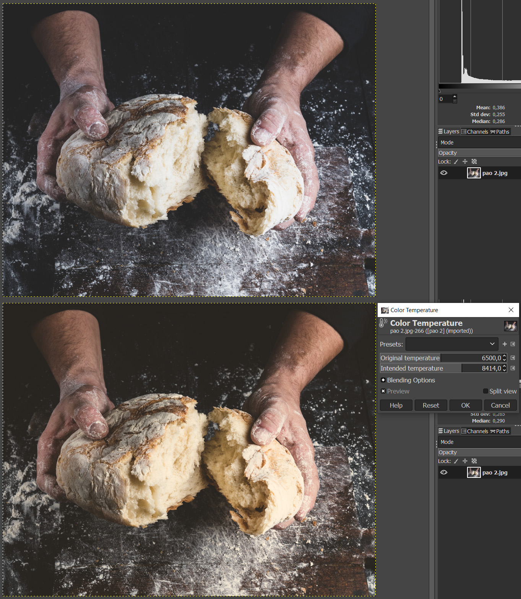

# Mais tratamentos

Além dos tratamentos que executamos em aula, o GIMP oferece outras opções para enriquecer visualmente suas imagens. Vamos conferir algumas delas a seguir:

## Exposure

A exposição tem relação direta com a iluminação da imagem, uma vez que faz alusão ao tempo de exposição do obturador da câmera no momento da captura da fotografia. Há dois sliders para ajustar o efeito:

- **Black level**: controla a quantidade de preto da imagem. Ele atua apenas sobre as áreas escuras.

- **Exposure**: simula a exposição da imagem à luz. Diferentemente do Black level, age tanto sobre as áreas claras quanto sobre as escuras. É um parâmetro a ser manipulado com cuidado, já que pequenas alterações produzem resultados bastante expressivos.

Esses ajustes podem ser muito úteis para incrementar o contraste, bem como trazer brilho para imagem ou ainda corrigir áreas subexpostas.

Compare o antes e depois desta fotografia subexposta. Como sabemos, ela teve exposição à luz, de modo que o ajuste Exposure consegue contornar esse problema ao simular justamente mais entrada de luz. Tenha atenção às sombras e não deixe que elas se percam, trazendo-as de volta com o Black level.

## Color temperature

Trata da temperatura da imagem, conforme o conceito de cores quentes (mais próximas do vermelho) e frias (mais próximas ao azul). Os ajustes são realizados em cima da fonte de luz da imagem na unidade de medida Kelvin (K). Assim como o Exposure, são dois sliders de controle:

- **Original temperature**: é a estimativa feita pelo GIMP da temperatura da fonte de luz original da imagem. É possível alterá-la porque não necessariamente a informação foi processada corretamente pelo software.

- **Intended temperature**: define a temperatura que você deseja para a imagem final.

A imagem original tem temperatura de 6500 K. Note como aumentá-la faz com que o resultado fique mais quente, bem apropriado para as cores em questão. Em alguns casos, pode ser que você deseje esfriá-la, como quando for tratar fotografias de ambientes mais frios.

### Mas afinal, qual ajuste escolher?

Essa é uma dúvida importante, ainda mais considerando que muitos ajustes podem produzir resultados similares. A resposta é simples: entenda a sua imagem e trabalhe com o que te deixa mais confortável. Levels, Curves e Exposure, por exemplo, podem ser usados para reforçar o contraste, mas com qual deles você tem mais liberdade para fazer ajustes finos? Estes ajustes finos são necessários ou simplesmente uma edição rápida soluciona o seu problema?

Tenha em mente as respostas destas questões e observe com atenção as características da sua imagem, comparando-a com referências. Sites como o **Unsplash** e o **Behance** são ótimos para isso. Avalie a iluminação com o Histogram e, por fim, lembre-se: não existe uma receita pronta para o bom acabamento de uma imagem e o GIMP oferece diversos caminhos para a mesma solução.

### [Menu - GIMP: edição e tratamento de imagens para identidade visual](menu.md)