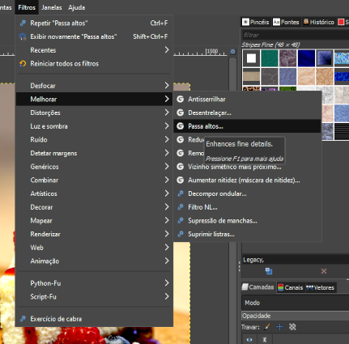

# Realçando detalhes

## Filtro para realçar detalhes da imagem

- `“Filters”`(`filtros`) - `“Enhance”`(`Melhorar`) - `“High Pass”`(`Passa altos`)

E quando clicar nesse filtro ele vai passar uma camada de cinza por cima da imagem e esse filtro vai realçar os detalhes da imagem, trazendo mais nitidez por meio de um aumento no brilho dos pixels dentro dos meio tons, ou seja, dentro das partes cinzas da imagem, que não são nem todas brancas, nem todas pretas.

Temos dois parâmetros para ajustar no High Pass, esse “Std. Dev.” é o standard deviation, ou seja, o desvio padrão, e o “Contrast” é o contraste. E como eles funcionam?

### [Menu - GIMP: edição e tratamento de imagens para identidade visual](menu.md)

