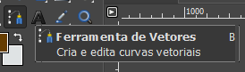

# Selecionando com Paths

A ferramenta de caminho, de path, se encontra na nossa barra de ferramentas, atende por este símbolo, e como ela funciona?

Desenha-se de ponto em ponto até fechar a seleção.

## Como funciona?

- Basta clicar e ir indo de ponto em ponto, aqui não temos uma linha indicando o que vai acontecer exatamente, mas ir de ponto em ponto até uma forma.

-  Se eu for clicando dessa maneira, os cantos são pontiagudos, mas se clicar e segurar, obtém cantos curvos na forma, e damos, por meio da curva de Bézier, com essas alças de ajuste, direção e volume para essa curva.

- Se quiseros fechar a forma, segura o “Ctrl”, você repare que vai aparecer um símbolo bem pequenininho de uma corrente junto ao cursor aqui e fecha-se a forma.

Nada aconteceu, mas se eu vier em “**Paths**” o que vai ter nessa abinha, um caminho novo aqui, está com o nome de “Unnamed”, ou seja, sem nome, porque eu não foi nomeado.

### [Menu - GIMP: edição e tratamento de imagens para identidade visual](menu.md)