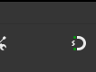

# O que é a ferramenta Snap? 

A ferramenta Snap é tipo um “imã” que te ajuda a alinhar objetos com precisão no Inkscape. Sabe quando você quer deixar tudo certinho, retinho, sem ter que ficar no "olhômetro"? Então, o Snap é a solução! Ele gruda os objetos em guias, notas, bordas de outros objetos, etc., facilitando a vida na hora de criar layouts, desenhos técnicos e tudo mais.

## Como usar o Snap?

### 1. Ativando o Snap:

- Vá no menu “Visualizar” e marque a opção “Snap”.
- Ou clique no ícone de "imã" na barra de ferramentas.

### 2. Configurando o Snap:

- Clique na setinha ao lado do ícone de "imã" para abrir as opções de Snap.
- Aqui você pode escolher em quais elementos o Snap vai - "grudar": guias, notas, nós de objetos, bordas, etc.
Experimente marcar e desmarcar as opções para ver como funciona cada uma delas.

### 3. Usando o Snap na prática:

- Selecione a ferramenta de desenho ou de seleção.
- Aproxime o objeto que você quer alinhar de outro objeto, guia ou grade.
- Quando o objeto estiver perto o suficiente, o Snap irá "grudar" automaticamente, posicionando o alinhamento.

### Dicas extras

- **Teclado**: Segure a tecla "Ctrl" para ativar o Snap temporariamente enquanto arrasta um objeto.
- **Precisão**: Use o zoom para ter mais precisão na hora de alinhar objetos com o Snap.
- **Criatividade**: Explore as opções de Snap para criar efeitos interessantes e layouts personalizados.

### [Menu Inkscape](../menu.md)