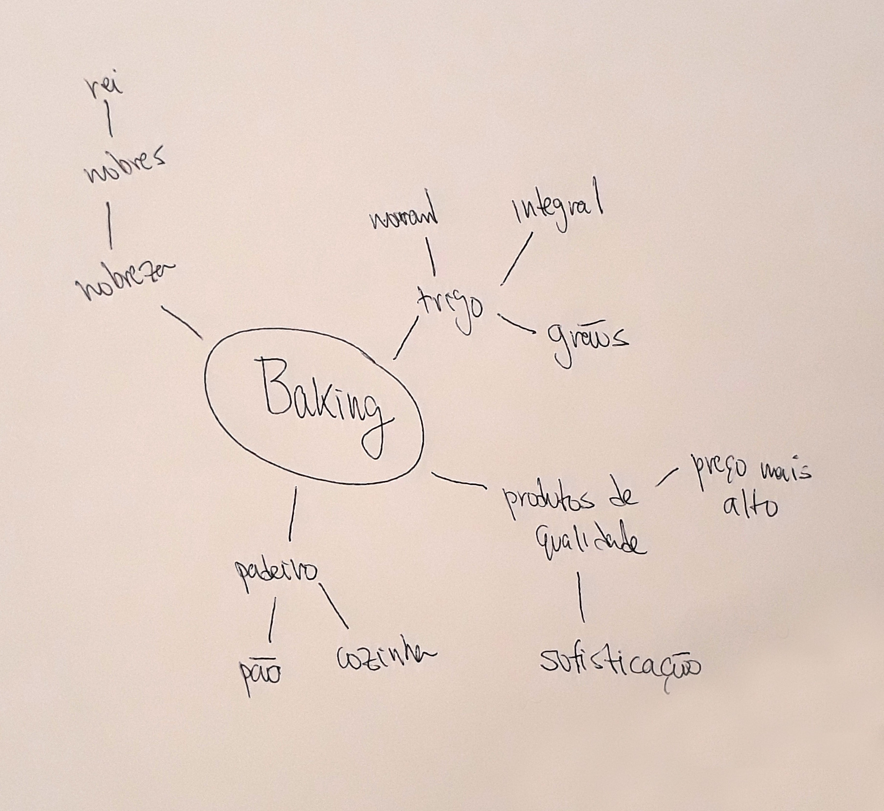

# Gerando ideias com o mindmap

A geração de ideias para um logo demanda uma boa dose de criatividade, afinal de contas queremos traduzir os conceitos da marca em um símbolo visual. Mas qual é a representação visual para um determinado conceito? Ou mesmo, quais são as associações mais comuns que fazemos em nossos cérebros quando ouvimos uma palavra? Por exemplo, quando você lê "padaria", o que vem à sua mente? Para organizar, então, as nossas ideias podemos utilizar uma ferramenta muito útil chamada mindmap (mapa mental, em português).

Com ela, criaremos um diagrama que agrupa os pensamentos por meio de associações naturais entre o que vem à nossa mente a partir de um ponto de partida. Como um logo pode se aproveitar visualmente do que justamente as pessoas têm guardado em suas cabeças sobre um palavra ou conceito, nada melhor do que um instrumento que nos ajude a enxergar essas associações com mais facilidade.

## Como funciona?

É muito simples! Você precisa apenas de uma folha de papel e uma caneta. Ou, se preferir, faça diretamente no computador. No centro da folha escreva a palavra que simboliza o seu ponto de partida - que para nós é o nome da padaria: Baking. Na sequência, registre tudo aquilo que você pensa quando lê "Baking" - levando em conta o trocadilho com "rei", em inglês - e lembrando de estar criando o logo para uma padaria mais sofisticada.

O resultado será um conjunto de palavras a partir das quais você poderá traçar relações e identificar quais são mais relevantes. Observe abaixo o meu resultado:

Com base no mindmap notei que "trigo", "rei" e "sofisticação" são os termos mais relevantes. Isso se deu tanto pelo fato de "trigo" ter várias outras palavras associadas à ela quanto "rei" e "sofisticação" serem derivadas de vocábulos anteriores, que é um indicativo de força.

## Quais são as vantagens do mindmap?

Com esta ferramenta você poderá:

1. ### Gerar mais ideias

Ao trazer para o papel (ou computador) o que está na sua cabeça você terá uma visão mais abrangente do assunto, conseguindo, inclusive vislumbrar o que está esquecendo. Paralelamente, transcrever seus pensamentos organiza as ideias que já existem e faz com que você possa se concentrar em novas.

2. ### Reproduzir a forma como nosso cérebro funciona

As tais "associações naturais" são exatamente isso: imitar o modo como o cérebro das pessoas faz ligações entre determinados tópicos. Explorar essas conexões contribuirá para que o seu logo seja mais facilmente vinculado aos conceitos que você deseja comunicar.

3. ### Ter uma visão macro do assunto

O mapa mental disposto à sua frente com as ideias organizadas lhe proporcionará notar padrões e esquecimentos. Você conseguirá, por exemplo, resolver se vai embarcar na tendência ou se vai ousar numa solução fora do padrão. Assim sendo, a decisão de seguir uma dada linha criativa poderá ser tomada com mais assertividade.

### [Menu Inkscape](../menu.md)