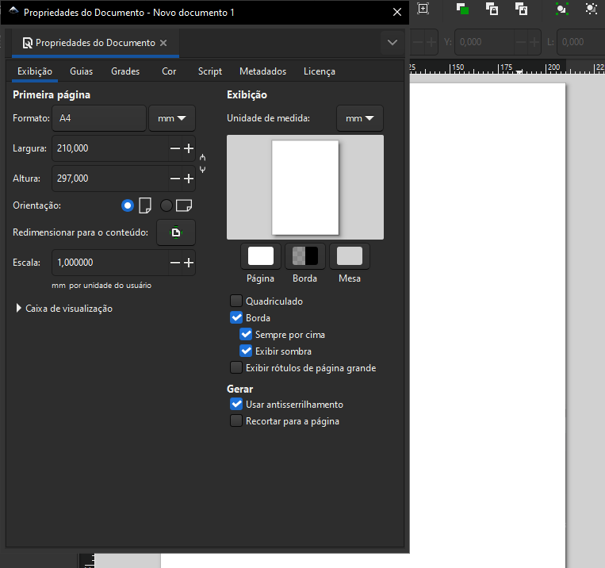
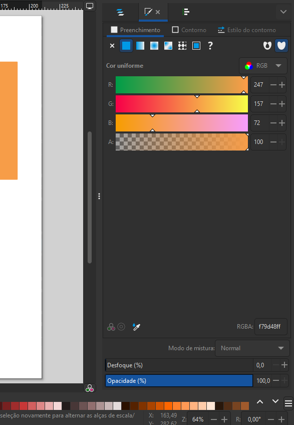

# Introdução ao Software

Ao entrar no aplicativo temos no uma prancheta de trabalho. Imagine que é como se fosse uma tela para o pintor, uma folha de papel para um escritor. É a mídia sobre a qual você vai realizar a sua criação e essa mídia vem, por padrão, em dimensões específicas. No caso aqui do Inkscape, de uma ***folha A4, com 21 centímetros por 29,7 centímetros de largura e altura***.

- **Para alterar as dimensões da prancheta**: “`File`”, no menu principal do Inkscape, clicar e selecionar a opção “`Document Properties`” (**propriedades do documento**). O atalho é “**Ctrl + Shift + D**”. 

## Como funcionam as ferramentas dentro do Inkscape?

Do lado esquerdo do nosso programa, temos as **ferramentas de criação**. Vamos começar com uma bem básica, que é a ferramenta de desenho de objetos geométricos, que desenha quadrados e retângulos. É bem intuitivo entender o que ela faz - afinal de contas o símbolo dela é um quadro.

Vamos clicar sobre ela. Note que em cima o painel vai mudar no momento que eu clico nela. Cada ferramenta vai ter um painel de propriedades aqui em cima próprio da ferramenta. A ferramenta retângulo e quadrado tem um painel próprio dela e o atalho dessa ferramenta. Repare que quando eu pouso o mouse sobre a ferramenta aparece o texto, é a tecla “`R`”.

Se eu desenhar à mão livre, **eu faço um retângulo**, se desenhar segurando a tecla “`Ctrl`” **eu faço um quadrado**. Se eu desenhar segurando as teclas “`Ctrl + Shift`” eu faço um **quadrado a partir do centro**. 

## Alterando a cor das formas 

Para alterar a cor das formas ou adicionar ou remover bordas, clicar na ferramenta de `seleção` - `Ctrl + s`. 

Ao clicar na imagem, no bottom da página temos 2 ícones: “Fill” é “preenchimento” em inglês, “Stroke” é “traçado”. Ao dar um duplo clique abre um painel do lado direto.

### 1. Selecionando e Alterando Núcleos:

- **Ferramenta de Seleção**: A seta preta (atalho "S") é uma chave para selecionar e interagir com as formas.
- **Painel de Preenchimento e Traçado**: Localizado na parte inferior da tela, este painel permite ajustar os núcleos de preenchimento ("Fill") e traçado ("Stroke").
- **Editando Cores**: Dê um clique duplo na cor atual para abrir o painel de edição de núcleos.
- **Abas de Edição**: As abas "Fill" e "Stroke paint" controlam os núcleos de preenchimento e traçado, respectivamente.
- **Opções de Cores**: Escolha entre cores sólidas ("Flat color") ou outras opções de preenchimento.
**Ajustando Traçados**: Na aba "Stroke style", defina a espessura e outras propriedades do traçado.

### 2. Transformando Formas:

- **Ferramenta de Seleção**: Selecione a forma que deseja modificar.
- **Ajustando Tamanho**: Arraste as setas ao redor da forma para redimensioná-la. Mantenha "Ctrl" para manter a proporção.
- **Rotacionando Formas**: Clique novamente na forma selecionada para que as setas se transformem em curvas. Arraste para girar. Segure “Ctrl” para girar em incrementos de 15 graus.

### 3. Alinhando e Distribuindo Formas:

- **Selecionando Múltiplas Formas**: Clique em uma forma, segure "Shift" e clique em outras para selecionar várias formas.
- **Painel de Alinhamento e Distribuição**: Acesse "Objeto > Alinhar e Distribuir..." no menu principal.
- **Opções de Alinhamento**: Escolha opções como centralizar verticalmente ou horizontalmente.
- **Relativo a**: Definir se o alinhamento será relativo à última forma selecionada ("Último selecionado") ou à primeira ("Primeiro selecionado").

### 4. Editando Formas com Precisão:

- **Painel de Edição de Ferramentas**: Localizado na parte superior da tela, este painel oferece opções específicas para cada ferramenta.
- **Valores Numéricos**: Insira valores numéricos precisos para largura ("w") e altura no painel de edição da ferramenta de seleção.
- **Proporcionalidade**: Mantenha o cadeado fechado ao ajustar as dimensões para preservar a proporção da forma.

### [Menu Inkscape](../menu.md)