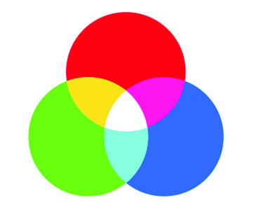
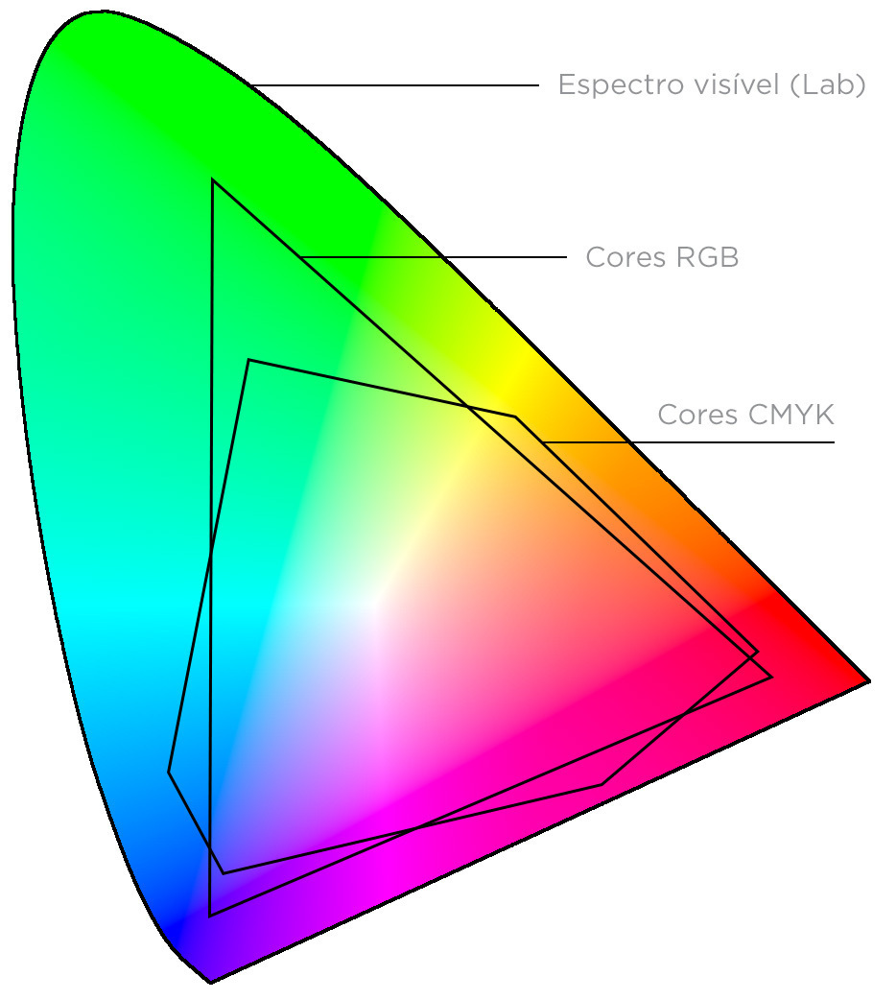
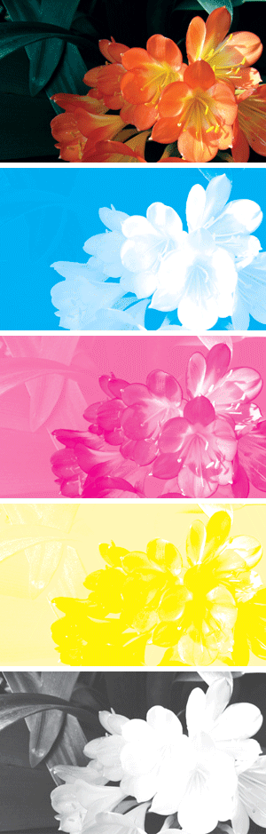
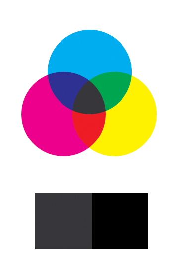

# Conhecendo os modos de cores RGB e CMYK

A variedade de cores que enxergamos é atingida por meio de diferentes modos. Dentre os distintos métodos, os mais importantes para os designers gráficos são os padrões RGB e CMYK. Vamos olhá-los mais profundamente e entender quais são as suas diferenças.

## RGB

É o modo utilizado em dispositivos como telas de TV, monitores de computadores, smartphones e projetores. Ele se baseia na mistura das luzes vermelha, verde e azul (em inglês: Red, Green e Blue) e é chamado de modo aditivo, uma vez que a sobreposição das suas cores resulta no branco (ao contrário do substrativo CMYK, no qual a sobreposição das cores tende para o preto).

Quanto mais se adiciona cada um dos tons básicos, mais próximo fica do branco, como podemos perceber no esquema.

A tela, diferentemente de uma mídia impressa, emite luz. Assim, o monitor parte da escuridão (preto) e depois que se acende a luz se dá a mistura das cores. A quantidade de luz transmitida a partir dos pixels para cada um dos pigmentos (vermelho, verde e azul) é definida em valores de 0 a 255. Se todos os valores forem zerados teremos o preto puro (a "tela desligada"), enquanto que com todos os valores em 255 teremos o branco puro.

Considere, então, a quantidade de combinações que três casas numéricas com 255 possibilidades cada podem gerar. Não à toa, o espectro de cores RGB - isto é, o universo de tons deste modo - é maior que o CMYK. **Na prática, isso significa que nem todas as cores vistas em tela poderão ser impressas.** Portanto, é importante selecionar o modo correto quando preparar seus materiais e evitar surpresas na hora da impressão.

O alcance de cores do espectro RGB é mais amplo que o CMYK. Note, por exemplo, como há menos tons de verde disponíveis para impressão.

## CMYK

Modo de cor majoritariamente utilizado para impressão. É a mistura de quatro pigmentos de tinta: ciano (C**), magenta (M), amarelo (Y, de yellow, em inglês) e preto (K*, de *black, em inglês) para a obtenção de uma vasta gama de cores, num processo conhecido como quadricromia.

No momento da impressão a imagem é separada em quatro canais: um para cada tinta. Uma vez sobrepostos e impressos, a imagem colorida é formada.

Como as mídias impressas não emitem luz (ao contrário de uma tela de computador ou smartphone), as tintas ciano, magenta, amarela e preta servem como filtros que subtraem diferentes espectros da luz branca que seria refletida.

Para formar as cores, então, cada um dos pigmentos sairá em uma determinada porcentagem de 0 a 100 (os valores que escolhemos no Inkscape, por exemplo). Dessa forma, 0% em todos os pigmentos indica que não há tinta e nenhuma luz é absorvida, refletindo o branco. Enquanto que 100% em todos os pigmentos significa carga máxima de tinta e consequente absorção total de luz, resultando no preto puro.

Repare como a sobreposição das cores CMYK gera tons mais escuros. O preto não é representado nestes círculos porque é adicionado depois, uma vez que a mistura de 100% de ciano, magenta e amarelo não gera um preto verdadeiro, conforme podemos ver na imagem.

### [Menu Inkscape](../menu.md)

