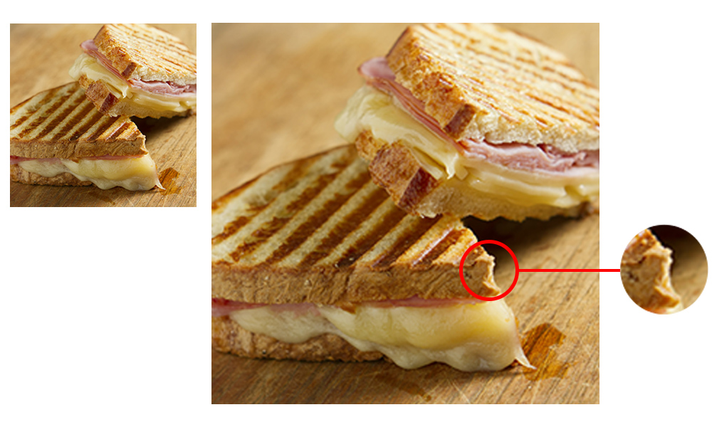
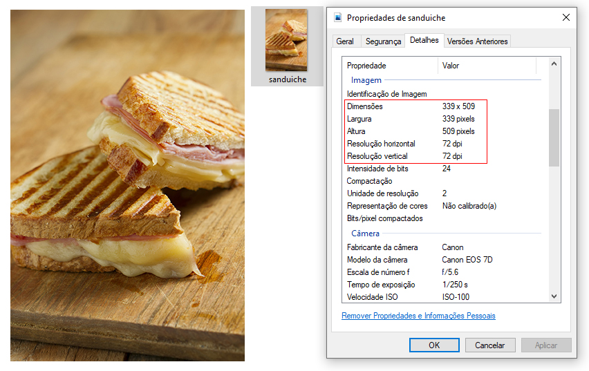
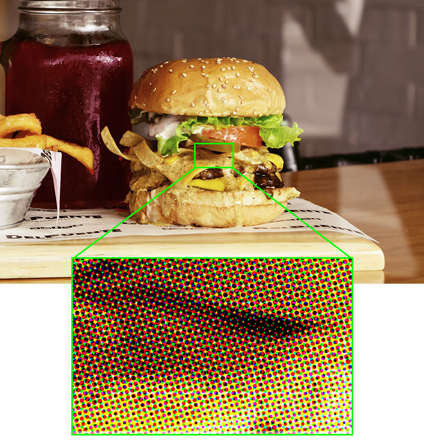

# Resolução de imagens

Imagens bitmap não podem ser ampliadas indefinidamente: a partir de um determinado ponto nós passamos a enxergar os pixels que a compõem, acompanhado do característico serrilhamento dos detalhes e a consequente perda de qualidade.

A imagem original, mais à esquerda, tem uma resolução que lhe confere qualidade em dadas dimensões. Quando extrapolamos essas dimensões passamos a ver as unidades que a constrói: os pixels, em conjunto com o serrilhado. Chamamos este efeito de ***pixelização***.

Isso acontece porque a imagem tem um número fixo de pixels e numa determinada concentração, fazendo com que a sua visualização com qualidade seja limitada, diferentemente dos vetores.

## Mas o que é resolução?

É a qualidade de uma imagem, ou seja, a sua capacidade de ser ampliada sem perder definição e expor os pixels. As suas unidades de medida são: PPI - Pixels Per Inche (pixels por polegada quadrada, em inglês) na tela e DPI - Dots Per Inche (pontos por polegada) nos impressos. Por enquanto podemos considerá-las como equivalentes. O importante é que elas nos informam a concentração de pixels numa determinada área. Quanto maior for a concentração, mais precisaremos ampliar a imagem para conseguir visualizá-los.

Por padrão, a resolução para tela é de 72 DPI. Porém, este número sozinho não significa muita coisa: ele está diretamente atrelado à altura e largura da imagem. Para facilitar o entendimento, vamos considerar o exemplo a seguir:

A fotografia do sanduíche tem a resolução de 72 DPI nas dimensões de 339 px x 509 px. Como o número de pixels é fixo, temos então uma relação inversamente proporcional entre os valores da resolução e da dupla largura e altura. Isto é, se aumentarmos um deles diminuiremos o outro. Portanto, ampliar esta imagem - ou seja, aumentar sua altura e largura - para além de 339 px x 509 px fará com tenhamos menos de 72 DPI de resolução. Quanto maior for a ampliação, menor será a resolução, podendo gerar a pixelização. Para verificar a resolução das suas imagens no Windows, como eu fiz com o sanduíche, clique sobre ela com o botão direito do mouse, selecione Propriedades e navegue para a aba Detalhes.

## A resolução para tela é diferente da resolução para impressão

Já na impressão não temos um valor padrão como acontece com a tela. Para saber como defini-lo é preciso compreender como se dá a impressão de uma imagem. Ela é feita por um processo em que pigmentos (tintas) são sobrepostos uns sobre os outros, gerando uma mistura de cores e o resultado aproximado daquilo que vemos em tela.

Esses pigmentos, por sua vez, são impressos sobre o papel (ou outra mídia) em minúsculos pontos, também chamados de retículas. Assim como na resolução para tela, quanto maior o número deles, mais suave será a transição entre as cores e melhor acabada a impressão. Assim como no caso dos pixels, quanto mais pontos, mais qualidade terá o impresso. A unidade, então, que mede a resolução de impressos é a DPI.

Uma imagem colorida impressa é gerada a partir de pontos sobrepostos nas cores ciano, magenta, amarelo e preto.

Um valor muito comum de resolução de impressão é o de 300 DPI. Materiais que serão visualizados a curta distância - a alguns centímetros, por exemplo - pedem muitos DPI porque a nossa visão conseguirá identificá-los individualmente caso sejam poucos (o que ocasionaria um resultado próximo ao da pixelização). O mesmo não acontece a longas distâncias: o cérebro humano agrupa os pontos, de modo que 300 DPI não serão mais necessários. Cartazes, banners, outdoors e demais materiais podem ter resoluções de 150 DPI, 75 DPI e 15 DPI, respectivamente, a depender das suas dimensões e sem perder qualidade.

### [Menu Inkscape](../menu.md)