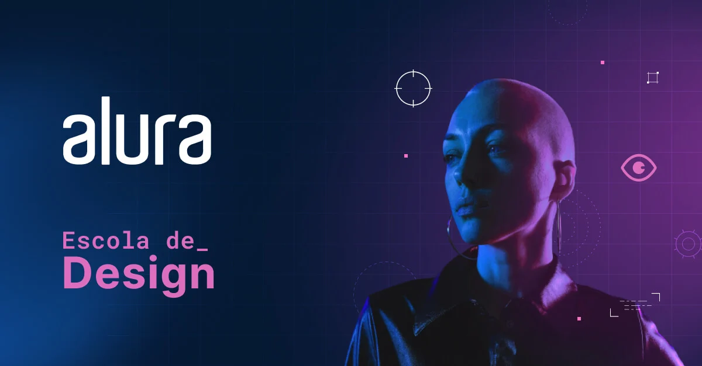

# Designer UI: básico ao avançado

## 🚀 Tecnologias

## 📚 Temas abordados

- ### [Identidade Visual com softwares gratuitos](./Identidade-Visual-Softwares-Gratuitos/menu.md)

<h2> 📞 Contato</h2>

 
  
  
   
  

