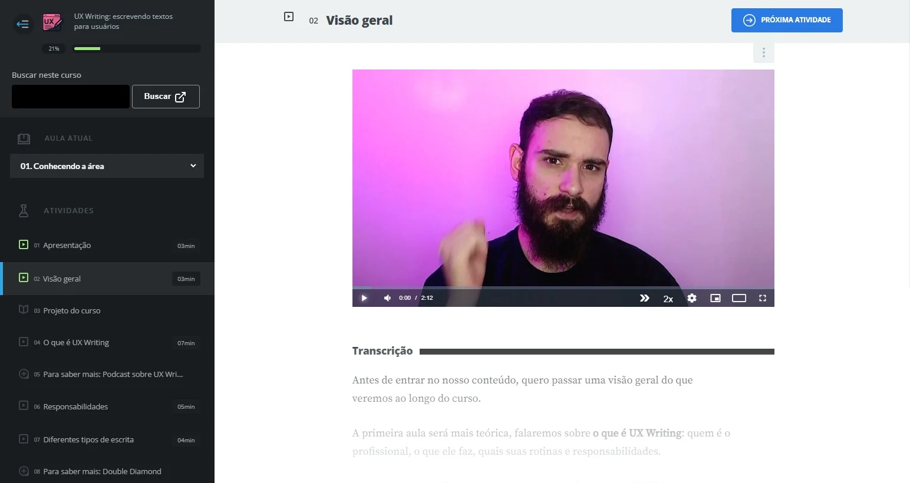
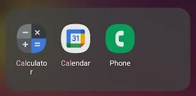
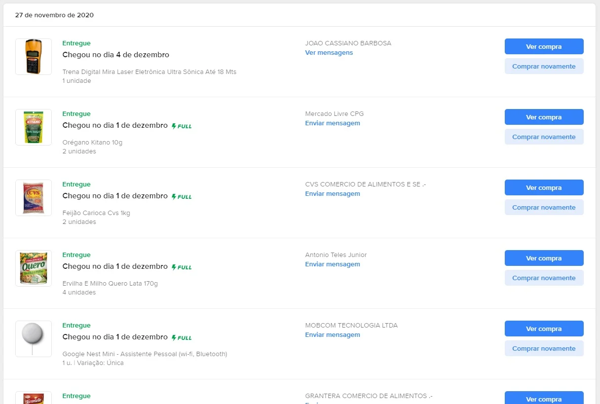
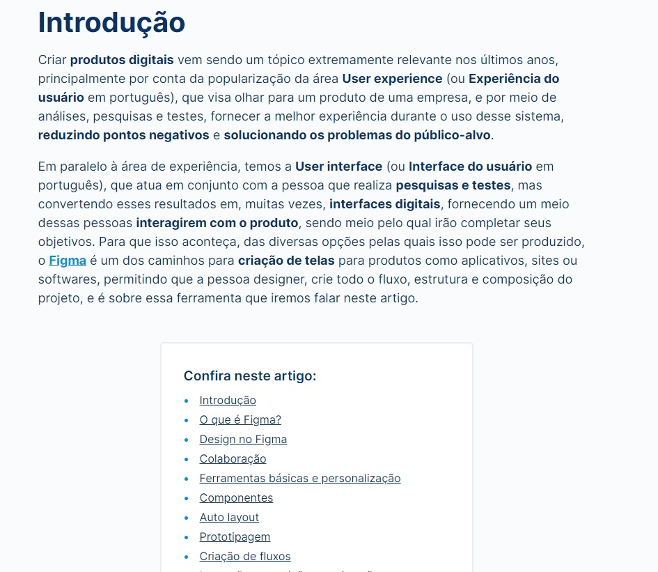
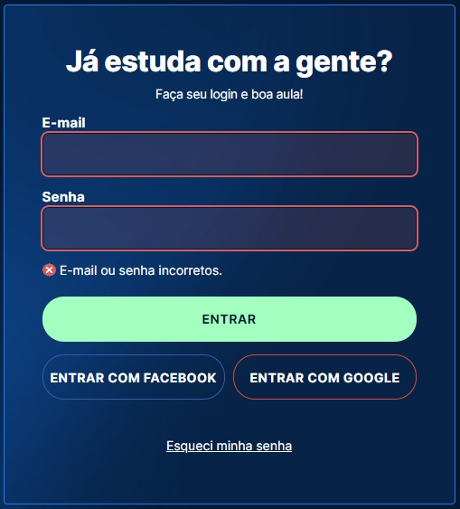
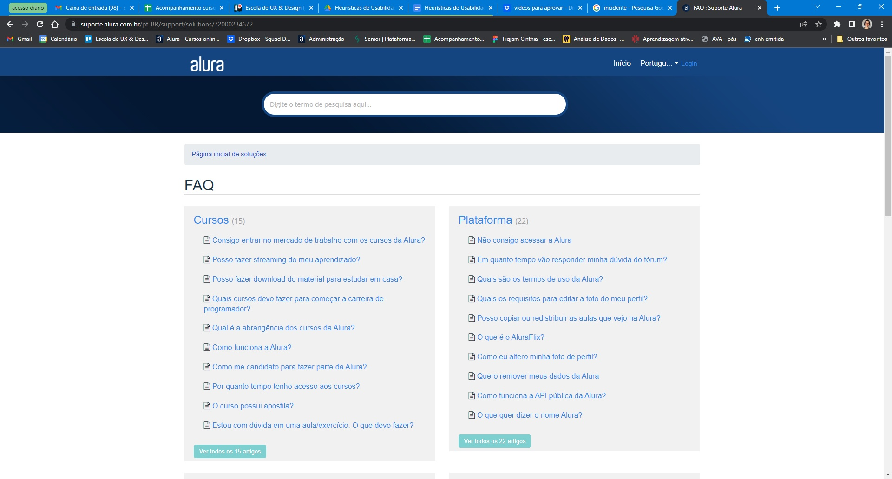

# 10 Heurísticas de Usabilidade para User Interface

Normalmente, quando falamos de experiência do usuário, acabamos remetendo apenas à pessoas específicas que fazem parte do público-alvo daquilo que estamos construindo, mas é importante lembrar que todos somos pessoas usuárias, pois constantemente estamos interagindo e utilizando inúmeras coisas, e claro que dentre elas estão as interfaces digitais, como as de websites e aplicativos, e da mesma forma que todas as pessoas no mundo, temos nossas próprias exigências.

Com o passar dos anos a tecnologia evolui, as tendências de design vão se atualizando, e tudo isso acontece para tornar a nossa vida mais fácil. Quanto mais prático um produto for, mais pessoas irá atrair, gerando sorrisos e feedbacks extremamente positivos, que é o resultado que todos almejamos desde a concepção até a entrega. Para que essa harmonia pudesse ser mantida em interfaces digitais, garantindo que a usabilidade fosse impecável, em 1994, o pesquisador de interação humano-computador, consultor de usabilidade e co-fundador da Nielsen Norman Group, Jakob Nielsen, criou as **10 Heurísticas de Usabilidade para User Interface**, servindo como um guia de boas práticas para manter a boa usabilidade em produtos digitais.

## 1. Visibilidade do status do sistema

A primeira heurística diz respeito ao fator da pessoa usuária poder diagnosticar na interface, por si só, sem a necessidade de ajuda extra, o que está acontecendo na interface. Entendendo o status da interface, a pessoa poderá decidir com mais facilidade quais passos deseja tomar em seguida.

Um exemplo perfeito dessa heurística acontece aqui mesmo, na plataforma da Alura, assistindo aos cursos. No lado esquerdo, temos uma barra exibindo todos os conteúdos de uma aula, indicando em qual você está atualmente, marcando as visualizadas, e possibilitando que você retorne ou avance nos itens.

## 2. Relação entre sistema e o mundo real

As heurísticas dizem respeito a usabilidade em produtos digitais, mas nossa vivência e familiaridade principal é com o mundo real. Para que algo se torne mais entendível, e o objetivo seja mais fácil de ser concluído, o ideal é se basear em palavras, símbolos, conceitos ou qualquer outra coisa que possa remeter elementos do nosso cotidiano para representar uma atividade. Para isso, o sistema deve conversar da mesma forma ou semelhante ao do seu público-alvo, e claro que se levarmos em consideração, cada pessoa é única, e por essa razão que se faz necessário entender quem são seus usuários para fornecer a comunicação ideal.

O seu smartphone tem muito disso, independente do sistema dele. Você pode notar que aplicativos como “Calculadora” ou “Telefone”, apesar de possuírem um visual específico, remetem diretamente a objetivos físicos. Sem precisar ler o nome do aplicativo, olhando apenas para o ícone, você já sabe diagnosticar perfeitamente do que se trata.

## 3. Liberdade e controle do usuário

Imagine que você está o dia inteiro num fluxo de trabalho. Nesse cenário, é normal se sentir cansado, e mais normal ainda acabar cometendo algum acidente, como apagar um e-mail que você nem mesmo leu. Nesse momento, mais do que tudo, a interface precisa colaborar para entender que isso pode ter sido um engano, e auxiliar você nessa recuperação. De forma breve, é como uma “válvula de escape” ou uma “saída de emergência”, como cita o próprio Jakob Nielsen.

Um exemplo desse acontecimento são nos próprios e-mails, em que após selecionar e excluir um ou mais, o sistema retorne uma notificação avisando da exclusão, e permitindo que essa ação possa ser desfeita com apenas um clique.

## 4. Padrões e consistências

Um dos mais relevantes aspectos quando pensamos na construção de produtos digitais é na aplicação da identidade da marca nas telas que estaremos prestes a criar. O mínimo que uma pessoa espera ao utilizar o produto é que os itens com os quais ela irá interagir, termos que irá ler, ou até mesmo fluxos que irá passar, possuam concordâncias e similaridades, para que o reconhecimento cognitivo seja cada vez maior.

A Google se tornou referência nessa heurística a partir do momento em que criaram o Material Design, seu próprio Design System. Note que todos os produtos da Google (principalmente nos seus aplicativos) possuem padrões visuais, permitindo que usuários dos seus produtos entendam e saibam utilizar facilmente a interface.

## 5. Prevenção a erros

Apesar de ser humano, ninguém gosta de errar. É algo que queremos o tempo todo evitar, mas que inevitavelmente pode acabar acontecendo, e como o próprio Jakob relata, existem dois formatos de erros que podem acabar acontecendo: o deslize, que ocorre pela falta de atenção, e o engano, que ocorre pela falta de compreensão. Você sabe tanto quanto eu que mensagens de erro são de suma importância, mas melhor do que isso é prever esses possíveis acidentes que, por mais que sejam mínimos, podem acabar surgindo.

Sei que já citamos essa empresa aqui, mas não há referência maior para ser citada. Quando você vai fazer uma pesquisa no Google, ao digitar algo no campo de busca, eles já tentam prever aquilo que você irá pesquisar, trazendo algumas sugestões. Isso não é só para evitar que você erre, como também para te guiar a um resultado mais assertivo.

## 6. Reconhecimento em vez de memorização

Usar um produto digital precisa ser fácil, e quando se trata de realizar um objetivo queremos fazer isso da forma mais rápida possível, sem a necessidade de pensarmos se estamos seguindo pelo caminho certo. Isso, de fato, implica em trazer interfaces que não possuam fluxos cujo precisamos memorizar cada etapa, ou até mesmo as informações que digitamos. O esforço nunca deve vir por parte da pessoa que está utilizando, mas sim do próprio sistema em facilitar esse trabalho.

Diversas plataformas de compra, como o Mercado Livre, possuem um histórico de compras, permitindo que possamos visualizar com detalhes os produtos que adquirimos no passado.

## 7. Flexibilidade e eficiência de uso

Nem todo mundo é expert em tecnologia. Usando um mesmo produto digital, de um lado pode ter uma pessoa extremamente experiente, e que não precisa de ajuda para o uso, mas do outro, podemos ter uma pessoa leiga, que ainda está se familiarizando e precisa de alguma forma ser guiada no sistema. Uma pessoa não precisa ter penalidades de uso por conta da outra, e é por isso que os produtos digitais precisam ter caminhos fáceis para quem possui experiência, mas também o caminho convencional, com guias, para as pessoas com menor afinidade.

O YouTube é uma plataforma que traz isso. Da forma convencional, você pode usar o cursor para clicar no ícone de “pause” e “play” dos vídeos, e até mesmo avançar e retornar na linha do tempo, mas também é possível realizar isso utilizando atalhos do teclado. Usando a tecla “espaço” ou “P”, é possível pausar ou dar continuidade no vídeo. Além disso, também é possível retornar ou avançar 5 segundos usando as teclas de “flecha para a esquerda” e “flecha para a direita”, ou 10 segundos usando as teclas “K” e “L”.

## 8. Estética e design minimalista

Pode parecer que essa heurística trata muito de como deve ser o visual de uma interface, mas na verdade, se trata de quais informações você exibirá numa página, e como será essa distribuição, de forma que não haja um peso enorme para quem estará absorvendo o conteúdo. O ponto principal é focar naquilo que é essencial para ser exibido, deixando de lado tudo o que não for de fato necessário ou relevante, pois qualquer conteúdo a mais que esteja numa tela irá competir diretamente com as informações importantes.

Sabe essa página do artigo que você está lendo agora, e de todas as outras que estão aqui na plataforma Alura? É um exemplo fiel a essa heurística. Pense que terrível seria que adicionássemos diversas informações ao redor que não fossem apenas o texto da postagem? Perder o foco seria fácil, não é?

Por isso a importância de um design que contenha apenas o necessário, sem poluição excessiva.

## 9. Ajudar o usuário a reconhecer, diagnosticar e recuperar-se de erros

Já falamos aqui sobre erros, que não gostamos que aconteça, e que apesar de evitarmos isso, eles podem acabar acontecendo. Se de fato uma pessoa errar, a interface não pode deixar que a frustração ganhe. Nessa hora, é preciso moldar o caminho para que essa pessoa usuária dê a volta por cima, entendendo o que aconteceu, o motivo disso, e como ela pode resolver isso sem dor de cabeça.

Em algum momento você deve ter errado uma senha ao fazer login em alguma plataforma, e o sistema retornou uma mensagem relatando o acontecimento. Esse tipo de mensagem que surge abaixo de campos de formulário, são os meios mais comuns dessa heurística.

## 10. Ajuda e documentação

O cenário ideal é que todo produto tenha informações de uso suficientes, não necessitando de detalhes extras ou explicações adicionais, mas determinadas situações exigem que haja alguma forma de indicação, desde as mais simples até as mais robustas, como páginas com tutoriais e explicações.

A indicação de imagem de cartão de crédito apontando para a área do código de segurança é bem comum em plataformas de compra, pois muita gente acaba por não saber o que é o código de segurança do cartão. Ao mesmo tempo, há aquelas empresas que criam páginas de FAQs (Frequently Asked Questions, ou Pergunta Frequentes), contendo os principais questionamentos das pessoas ao utilizar um serviço.

### Conclusão

É impossível pensar em criar produtos digitais sem pensar nas pessoas que irão utilizá-los, afinal, nossa profissão só existe graças a essas pessoas que possuem necessidades, fazendo com que precisemos criar algo que seja não só inovador, como também fácil de ser usado.

O mais curioso, é que essas heurísticas, apesar de funcionarem muito bem com os produtos digitais atuais, foram criadas no ano de 1994, pouquíssimo tempo do lançamento público da Web. Isso nos faz perceber que trazer uma boa experiência para pessoas no ambiente digital não é uma preocupação que nasceu agora, e muito menos dentro desse século.

- ### [Artigo de Mateus Villain para a Alura](https://www.alura.com.br/artigos/10-heuristicas-usabilidade-para-user-interface)

### [Voltar ao Menu - UI Design para Devs](./menu.md)
