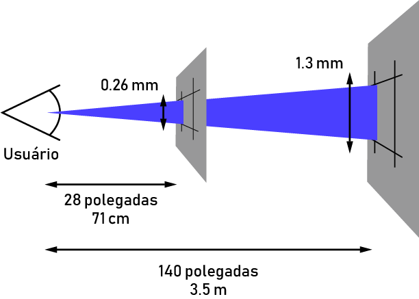
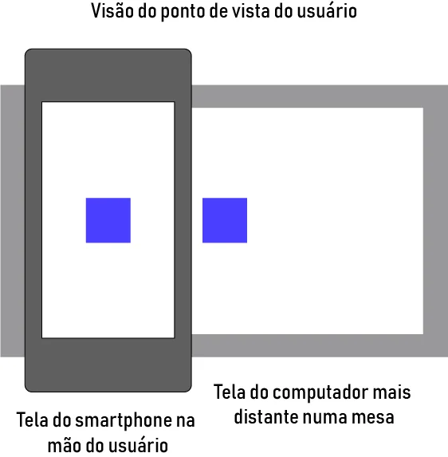
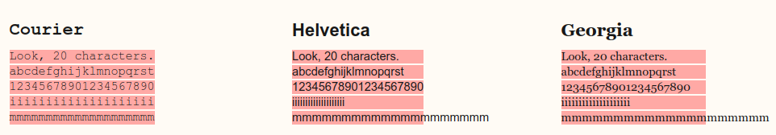

# Guia de Unidades no CSS

Quando começamos a lidar com desenvolvimento web, mais especificamente **HTML** e **CSS**, é bastante comum que fiquemos presos às ferramentas que já conhecemos e temos familiaridade.

Porém, isso pode se tornar um problema devido ao grande crescimento da Web e, com isso, o surgimento de novos problemas e consequentemente novas soluções. Esse é uma situação corriqueira quando lidamos com unidades de medidas no **CSS**, pela grande variedade, acabamos deixando de lado parte das existentes e não utilizamos, de fato, todo o poder que temos na mão.

Existem algumas unidades que provavelmente você já está acostumado, como o famoso pixel! Nesse post, abordaremos todas as unidades de medidas presentes atualmente e como elas podem nos ajudar durante sua jornada como desenvolvedor web. Antes de prosseguirmos, precisamos entender qual a diferença entre **medida absoluta** e **medida relativa**.

## Medidas Absolutas

Essas são as mais comuns que vemos no dia a dia. São medidas que não estão referenciadas a qualquer outra unidade, ou seja, não dependem de um valor de referência. São unidades de medidas definidas pela física, como o **píxel**, centímetro, metro, etc...

Essas medidas são fixas e não mudam de acordo com as especificações do dispositivo. Esse tipo de medida é indicada para quando conhecemos perfeitamente as características físicas e as configurações das mídias onde serão exibidos nossos projetos.

## Medidas Relativas

Essas são as que normalmente não estamos habituados. Essas medidas são calculadas tendo como base uma outra unidade de medida definida, como por exemplo

**em** e o **rem** (veremos mais sobre essas duas medidas no decorrer do post). O uso delas é mais apropriado para que possamos fazer ajustes em diferentes dispositivos garantindo um layout consistente e fluido em diversas mídias.

Devido ao fato de que essas medidas são calculadas pelo browser baseando-se em outra unidade, elas tendem a ser bastante flexíveis. Ou seja, podemos ter resultados diferentes de acordo com o ambiente.

Para começarmos a caminhar pelas medidas existentes, optei por começar pelas medidas absolutas, uma vez que estamos, normalmente, mais familiarizados com essas. Como diria meu amigo Flávio Almeida, bem começado, metade feito!

## Medidas absolutas no CSS

### Píxels (px)

Provavelmente você já conhece ou ouviu falar desse rapaz chamado Píxel. Píxel nada mais é do que os pequenos pontinhos luminosos da tela do seu monitor, celular, televisão, etc... Logo, o píxel é o menor elemento em um dispositivo de exibição!

Essa é uma medida bastante famosa para os web designers, grande parte dos desenvolvedores web usam o píxel como unidade principal de seus projetos.

Um detalhe que poucos conhecem é que na verdade, o píxel do CSS **NÃO** é realmente um píxel da tela do dispositivo (hardware), e sim o que chamamos de **píxel de referência** que geralmente é maior do que o píxel real. O que acaba por torná-lo numa medida abstrata onde é necessário controlar o mapeamento desse píxel de referência para o píxel do hardware (acontece por debaixo dos panos!).

A definição de píxel de referência no **CSS** é o ângulo visual(0.0213deg) de um píxel em um dispositivo com a densidade de 96dpi a uma distancia de um braço do leitor (28 polegadas), veja na imagem abaixo:



O benefício desse **píxel de referência** é que ele leva a proximidade da tela em consideração, ao usarmos um celular que seguramos próximos de nós, o píxel de referência terá o tamanho semelhante ao de um monitor mais distante de nós, por exemplo.  



Portanto, não existe esse papo de que o píxel é "perfeito". Só se estivermos desenvolvendo um site para um mesmo dispositivo, com um mesmo tamanho de tela e que usa o mesmo navegador, mas sabemos que não é assim que funciona no mundo lá fora!

Um ponto interessante de se comentar é que recentemente o **boostrap 4** deixou de utilizar **PX** e migrou para **REM** , além disso, o uso do píxel nos dá a sensação de que esse é igual ao píxel do hardware, o que pode gerar confusão para novos desenvolvedores.

Um dos aspectos mais importantes para esses Web Designers é a **escalabilidade e adaptabilidade de um layout**, ou seja, a medida em que as unidades aumentam de uma maneira previsível e razoável, seu layout deve ser capaz de se adequar a essas mudanças.

De um lado, a ideia de se manter o mesmo aspecto (tamanho) em diversos dispositivos pode parecer atrativa (cuidado com o píxel de referência!), mas do outro lado, temos consequências negativas quando estamos lidando com dispositivos de baixa resolução (**blurry rendering**). 


### Points (pt)

A **próxima unidade é Point**. Definitivamente essa unidade é mais conhecida pelos designers, principalmente os que estudam tipografia.

Essa medida é geralmente utilizada em propriedades relacionadas a fonte do seu projeto. Sua abreviação se dá com a marcação de **pt** e seu uso não é tão comum, você provavelmente verá essa unidade muito raramente.

Geralmente espera-se que essa medida seja utilizada em folhas de estilo para **impressões**, quando se precisa ter certeza do tamanho da fonte utilizada. **Não é recomendada para a estilização em tela!**

### in (inches/polegadas)

**Polegada ou inch** em inglês é mais uma unidade de medida que conhecemos do mundo das medidas absolutas - geralmente vemos elas quando queremos comprar uma nova TV ou monitor , mas essa unidade também existe no mundo Web.

Apesar de existirem, elas não costumam ser utilizadas em projetos, uma vez que não existem um uso prático para elas (podemos atingir os mesmos resultados utilizando outras unidades)

### Centímetro e Milímetro (cm / mm)

Nós brasileiros, que adotamos o sistema métrico, conhecemos bem essas duas medidas, que são bastante utilizadas no dia a dia. Apesar de bastante comuns, tanto centímetro e milímetro são pouco usadas no CSS. Assim como o pt, o uso dessas duas é esperado para folhas de estilo para impressões (medidas mais precisas), evitando que elas sejam aplicadas para exibições em tela.

### Paica (pc)

Também uma unidade pouco usada no mundo web, a Paica também vem para o CSS sendo herdada da tipografia. Por não ser uma unidade amplamente conhecida, ela acaba sendo fadada ao esquecimento, mas é sempre importante conhecermos todas as ferramentas que estão à nossa disposição. A relação entre as unidades absolutas é:

```
1 in = 2,54cm = 25,4mm = 72pt = 6pc
```

## Medidas Relativas no CSS

### Ems (em)

Nossa primeira unidade relativa é bastante famosa no mundo **CSS**. Dificilmente você achará algum navegador que não tenha suporte para essa medida, que está presente desde os primórdios. Até para o IE, nós teríamos que usar a versão abaixo da 3.0 para que tivéssemos algum problema.

Esse definitivamente é um dos pontos que fazem o **em** tão popular. O segundo ponto, com certeza se dá a facilidade de criar layouts fluídos e responsivos.

```
Mas como funciona esse tal de em?Essa unidade muda para os elementos filhos de acordo com o tamanho da fonte (font-size) do elemento pai, então vamos lá. Digamos que temos o seguinte html, me permitindo a licença poética de utilizar a tag style:
```
```
<style>
    #pai{
        font-size: 16px;
    }

    #filho{
        font-size: 2em;
    }
</style>

<div id="pai">
    div pai
    <div id="filho">
        div filho
    </div>
</div>
```

Acima, temos uma div pai onde estou definindo um font-size de 16px, dentro dessa div, temos uma única div filha. Como havia mencionado, o tamanho definido para a fonte impactará no **em** dos elementos filhos.

Nesse nosso caso, para a div mais interna (id=filho), **1em será igual a 16px**, seguindo a lógica, **2em será igual a 32px** e assim por diante. Podemos colocar valores como 1.5 também! Nesse nosso caso, **1.5em será igual a 24px** Quando expressamos tamanhos como margin, padding utilizando em, isso significa que eles serão relativos ao tamanho da fonte do elemento pai.

Portanto, de acordo com o tamanho da fonte utilizada em determinado elemento, os elementos filhos serão redimensionados de forma a obedecer a referência a esse tamanho de fonte!

Uma técnica bastante utilizada consiste justamente em fazer uso desse poder do **em** componentizando nossos elementos. A ideia é que a alteração do tamanho da fonte do elemento pai faça com que todo o componente se modifique e redimensione baseando-se nesse novo valor.

O último ponto que devemos nos atentar ao usar o **em** é que quando usamos essa medida, nós temos que considerar o font-size de todos os elementos pai. Por exemplo, se tivéssemos uma terceira div mais interna no nosso exemplo anterior e definirmos o tamanho da fonte para 2em, nesse caso esses 2em seriam 64px, uma vez que o font-size do elemento pai foi definido sendo 32px(2em)! Pegou o pulo do gato?

Isso tende a se complicar quando estamos falando de 5, 6, 7 divs aninhadas, provavelmente não será muito divertido calcular isso! Mas a boa notícia é que temos uma unidade que nos ajuda a resolver esse probleminha.

### Rems (rem, "root em")

O **REM** vem como sucessor do **EM** e ambos compartilham a mesma lógica de funcionamento (font-size), porém a forma de implementação é diferente. Enquanto o **em** está diretamente relacionado ao tamanho da fonte do elemento pai, o **rem** está relacionado com o tamanho da fonte do elemento root (raiz), no caso, a **tag HTML**.

O fato de que o **rem** se relaciona com o **elemento raiz** resolve aquele problema que tínhamos com diversas divs (elementos) aninhados, uma vez que não haverá essa "herança" de tamanhos, lembra?! Ou seja, não precisaremos ter dor de cabeça tendo que realizar cálculos, uma vez que nos baseamos na tag raiz.

E**xemplificando**, sabemos que a **tag html** é a **tag raiz** de todo documento html. Dito isso, se definirmos que **o font-size desse elemento será de 18px, então 1rem = 18px, 2rem = 36px** e assim por diante... Normalmente os browsers especificam o **tamanho default da fonte do elemento root (raiz) sendo 16px**, então guarde isso no coração! Mesmo essa unidade sendo mais tranquila de se trabalhar, ela não era muito utilizada para design responsivo, o que de primeira pode soar um tanto quanto estranho...

O motivo para isso é o suporte para essa medida. O chrome e o firefox suportavam tranquilamente, assim como o Opera e o Safari, porém, antigamente grande parte dos usuários utilizavam o IE, mais específicamente o IE 8, e esse browser não lidava muito bem com os **rems**, isso fazia com que os desenvolvedores precisassem optar por alguma unidade diferente, em muitos casos, o próprio **em**.

Como disse acima, o valor base é 16px, e isso pode acabar gerando dificuldades para que encontremos alguns tamanhos padrões que costumam ser utilizados. Por exemplo, como faríamos para atingir um tamanho de **10px** utilizando **rem**? Precisamos calcular.

BASE 16PX

```
10px = 0.625rem
12px = 0.75rem
14px = 0.875rem
16px = 1rem
18px = 1.125rem
```

e assim por diante, realmente não são números muito "amigáveis" ou convenientes 

### Porém, podemos lançar mão de um pequeno truque para nos ajudar (62,5%)

```
html{
    font-size: 62,5%;
}

h1{
    font-size: 1.2rem;  /*equivalente a 12px*/
}

p{
    font-size: 2.4rem; /*equivalente a 24px*/
}
```

Repare que dessa forma, o valor em píxel será sempre o valor definido em **rem** vezes 10! Fica mais conveniente, concorda?

Apesar de parecer uma boa ideia, devemos ter cuidado com essas abordagens, uma vez que ela forçará que você reescreva todos os font-size do seu site, então tome cuidado!

Existe uma terceira visão sobre isso tudo. Essa solução utiliza px, em e rem de maneira bem definida. A ideia consiste em definir o font-size do elemento root em píxel, módulos utilizando rem e elementos interiores aos módulos utilizando em, facilitando a manipulação do tamanho global que naturalmente escalará o tamanho para os módulos (utilizando rem) e esses por sua vez escalarão os elementos interiores (que utilizam em e referenciam ao elemento pai). 

### Porcentagem (%)

Apesar de não ser uma unidade de medida, a porcentagem costuma ser bastante utilizada quando falamos de layout responsivo e fluido, por isso, não poderia deixá-la passar.

A porcentagem permite que criemos módulos que sempre vão se readaptar para ocupar a quantidade especificada. Por exemplo, se definirmos um elemento tendo um tamanho de 50%, independente do dispositivo em questão, esse módulo sempre ocupará metade do espaço que lhe cabe (caso esteja dentro de algum outro elemento).

A porcentagem tem um comportamento um tanto parecido ao nosso já conhecido **em**, já que ele se relaciona diretamente com o tamanho da propriedade do elemento pai.

Portanto, ao trabalharmos com a porcentagem, temos o mesmo problema que tinhamos com o **em**, quanto mais elementos aninhados, mais complicado será de definirmos exatamente o tamanho, por isso, tenha cuidado quando utilizá-la!

### Ex

Talvez você nunca tenha ouvido falar dessa unidade do CSS, mas ela existe. Diferentemente da forma como a **EM** e a **REM** funcionavam, essa unidade não se relaciona com o tamanho da fonte (font-size), mas com qual fonte está sendo utilizada naquele momento (font-family), mais especificamente ao tamanho do caractere x dessa fonte em questão (x-height).

Como o browser sabe esse valor? Esse valor pode vir diretamente com a fonte, o browser pode medir o caractere em caixa baixa (lower case) e se esses dois não funcionarem, o browser estipula um valor de **0.5em para 1ex**.


Com isso, se quando mudamos o tamanho da fonte (depende do elemento) o **em** e o **rem** mudam, dessa vez, quando alteramos completamente a fonte, o **ex** mudará. O uso dessa unidade está mais presente em ajustes tipográficos, nos dando um controle mais preciso quando o padrão definido para algumas tags não se adéqua corretamente ao nosso layout.

### Ch

Também uma unidade pouco conhecida, o **ch** (character unit) é definida na documentação como sendo a "medida avançada" da largura do caractere zero ("0").

Existe uma discussão antiga onde se debateu bastante sobre essa unidade e o que realmente seria "medida avançada". A ideia é que um elemento com, por exemplo **100ch** de largura poderá comportar uma string de 100 caracteres dessa determinada fonte, caso essa fonte seja monospace (todos os caracteres têm o mesmo tamanho).

É comum acharmos definições que dizem que a frase acima se aplica para qualquer fonte, porém isso está errado. Como mencionei acima, a regra de **1ch = 1 caractere** se aplica apenas se a fonte usada for **monospace** (largura fixa). Fontes com a largura variável, qualquer caractere pode ser mais largo ou menos largo que o zero ("0"), como podemos ver na imagem abaixo:  



Como podemos analisar, a tipografia Courier (monospace) obedece a regra acima, porém as outras duas não! O que podemos tirar após observações é que normalmente **1ch** é 20% - 30% mais largo, porém isso não é uma verdade absoluta e deve ser observado para cada fonte que você deseja aplicar. Por isso, tome cuidado com o uso!

### Vw (viewport width)

Essa medida faz parte das medidas mais atuais e do futuro do CSS. Viewport units.

Como escrito no título, **vw** significa viewport width, mas o que é viewport?

Viewport nada mais é que a área visível de uma página web para o seu usuário, essa viewport pode variar de acordo com o dispositivo, sendo menor em celulares e maior em desktops.

Antigamente, quando não existiam tablets e celulares capazes de acessar sites, todas as web pages eram pensadas para a tela de um computador, com tamanho fixo e design estático. Com a chegada desses dispositivos móveis, essas páginas eram grandes demais para serem exibidas nesses aparelhos, o que tornava muito difícil a navegação.

A primeira solução partiu dos browsers desses dispositivos, eles adotavam um comportamento de retirar o zoom de forma que o site inteiro coubesse na tela do aparelho,definitivamente não era o ideal, mas uma solução rápida. No HTML5, foi introduzido uma maneira para que os desenvolvedores conseguissem alterar a viewport através da **tag**, corrigindo esse problema de usabilidade relacionado aos dispositivos móveis, mas isso é assunto para outra postagem!

Voltando para o nosso querido **vw**, essa unidade se relaciona diretamente com a largura da viewport, onde **1vw** representa **1%** do tamanho da largura dessa área visível. A diferença entre **vw** e a % é bem semelhante a diferença entre **em** e **rem**, onde a **%** é relativa ao contexto local do elemento e o **vw** é relativo ao tamanho total da largura da viewport do usuário.

### Vh (viewport height)

Essa unidade funciona da mesma forma que o **vw**, porém dessa vez, a referência será a altura e não a largura. Existem diversos exemplos práticos e interessantes de uso dessas duas unidades. 

### Conclusão

Como podemos perceber, existem várias unidades que podemos utilizar no mundo web, mas sempre surgem aquelas perguntas de quando tenho que utilizar? Qual a melhor? etc...

Não existe resposta certa nem errada para essas perguntas, infelizmente não temos uma regra de ouro para todas as situações. O uso dessas unidades depende de diversos fatores como equipe, preferência, familiaridade e assim por diante.

Entretanto, é importante que você como web developer tenha todas essas ferramentas no seu cinto de utilidades já que nunca sabemos quando precisaremos utilizar.

Definitivamente a inclusão das unidades da viewport foram positivas para a web quando estamos lidando com layout flexível, cabe a você começar a colocá-las em uso durante seu dia a dia!

- ### [Artigo de Paulo Scalercio para a ALURA](https://www.alura.com.br/artigos/guia-de-unidades-no-css)


### [Menu Fundamentos do Designer](../menu_fundamentos-Designer.md)