# UI Design: o que é, UX vs UI e um Guia da profissão de UI Designer

## Introdução: UI Design

Com o crescimento exponencial da tecnologia e os dispositivos digitais cada vez mais presentes em nossas vidas, a interface do usuário (UI) se tornou um elemento crucial para o sucesso de qualquer produto ou plataforma. Desde aplicativos móveis e sites até sistemas e dispositivos inteligentes, o design da interface do usuário desempenha um papel central na forma como interagimos com a tecnologia.

A interface do usuário serve como uma ponte entre a pessoa usuária e o produto, proporcionando uma experiência de uso que seja intuitiva, eficiente e agradável. O **UI Design** (User Interface Design) é fundamental nesse contexto, pois tem o objetivo de criar interfaces que permitam aos usuários **navegar facilmente, compreender a funcionalidade do produto ou serviço e ter uma experiência positiva**.

## O que é UI Design?

O UI é uma área do design que se concentra na criação e aprimoramento das interfaces com as quais os usuários interagem em produtos digitais, como aplicativos, sites, sistemas embarcados, dispositivos inteligentes e softwares. É responsável por projetar a aparência visual, a disposição dos elementos e a interação do usuário com a interface.

Seu propósito é facilitar a usabilidade e a experiência do usuário, garantindo que a interface seja intuitiva, eficiente e agradável de usar. Além da estética, o **UI Design** também envolve a construção de **interações significativas entre o usuário e a interface**. Isso inclui a definição de como os elementos visuais respondem às ações do usuário, como animações, transições e feedback visual, para tornar a experiência mais fluida e compreensível.

O UI Design trabalha em conjunto com outras áreas do design, como o UX Design (User Experience Design), que se concentra na experiência geral do usuário com o produto, incluindo a arquitetura da informação, a usabilidade e a pesquisa do usuário. O UI Design complementa o UX Design ao traduzir as diretrizes e princípios de usabilidade em elementos visuais e interativos. Para entender um pouco mais sobre o universo do UI e seus princípios assista o vídeo abaixo:

- ### [Semana de UI da Alura](https://www.youtube.com/watch?v=8FATGafQdzw&t=2s) 

## Mas afinal, o que é uma interface?

Uma interface é a **ponte de comunicação que permite que as pessoas interajam com máquinas e sistemas de maneira efetiva**. Imagine que você está usando um aplicativo em seu smartphone. A interface deste aplicativo é o que você vê na tela do seu dispositivo e como você interage com ele.

Por exemplo, quando você toca em um ícone na tela, a interface interpreta esse toque como um comando e realiza uma ação correspondente, como abrir um aplicativo ou exibir uma nova tela. Da mesma forma, quando você digita algo em um campo de texto ou desliza o dedo na tela, a interface reconhece essas ações e as transforma em resultados visíveis ou operações no aplicativo.

Uma interface eficaz é projetada levando em consideração as necessidades e expectativas das pessoas usuárias. Ela deve ser intuitiva, o que significa que os elementos e controles devem ser dispostos de forma lógica e fácil de entender. Além disso, a interface deve ser amigável, ou seja, não deve apresentar obstáculos desnecessários ou complexidade excessiva.

Pense na diferença entre uma interface intuitiva e uma confusa. Uma interface intuitiva torna fácil para os usuários realizar tarefas, encontrar informações e navegar pelo sistema sem muita dificuldade. Por outro lado, uma interface confusa pode levar a frustração, erros e uma experiência geral desagradável.

Vale destacar que uma interface pode assumir diferentes formas, como uma tela sensível ao toque, um teclado, um mouse, botões físicos, comandos de voz ou até mesmo comandos cerebrais. Ela fornece os meios para transmitir informações, receber entradas e exibir resultados de maneira compreensível para a pessoa usuária.

A escolha da interface afeta diretamente a performance que seu produto irá apresentar, ao criar um UI design, precisamos ter em mente qual a expectativa desse desempenho.

## Quais são os principais elementos de uma interface?

Quando pensamos em elementos de uma interface, acabamos pensando em botões, campos de texto, ícones, imagens e tipografia. E estamos totalmente corretos. Os elementos de uma interface são blocos de construção que permitem às pessoas usuárias interagirem com um produto. Esses elementos podem ser divididos em quatro categorias:

1. **Componentes de entrada**: São elementos interativos que permitem aos usuários inserir dados no sistema. Exemplos incluem:

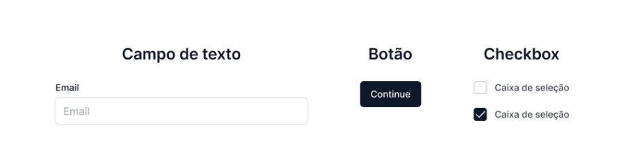

2. **Componentes de navegação**: Esses elementos auxiliam na navegação por um site ou produto. Exemplos incluem:

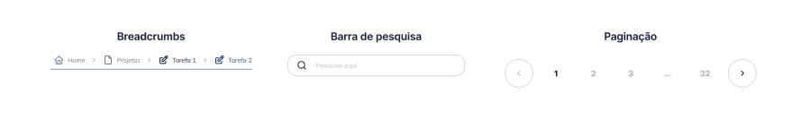

3. **Componentes informativos**: Esses elementos ajudam a compartilhar informações com os usuários. Exemplos incluem:

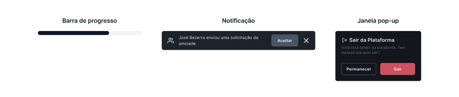

4. **Tipografia e estilo**: São elementos tipográficos, cores e estilos para melhorar a legibilidade e a aparência visual da interface.

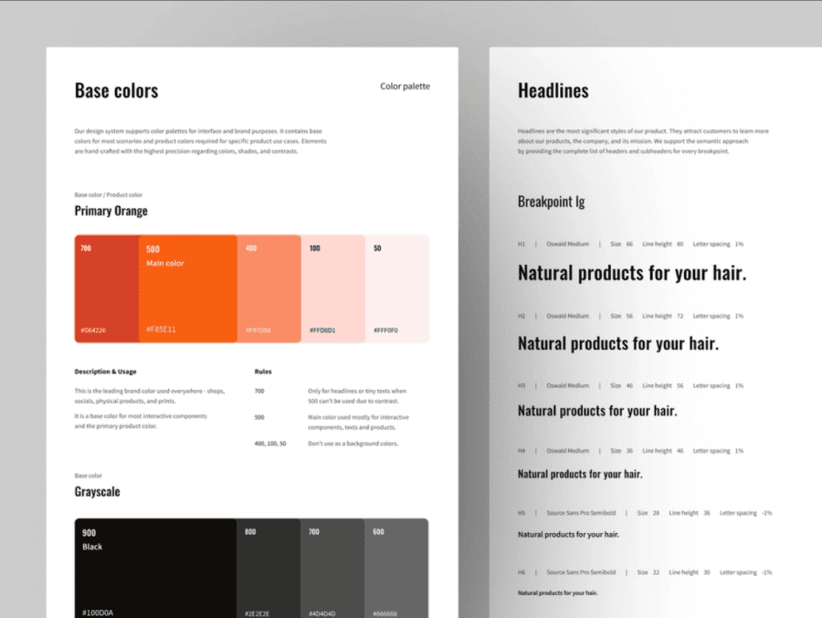

## Princípios de UI

Os princípios de UI Design são fundamentais para criar interfaces eficientes, agradáveis e fáceis de usar. Existem alguns **princípios-chave** que devem ser considerados ao projetar uma interface de usuário eficaz. No infográfico abaixo, listamos os 10 princípios mais importantes de UI.

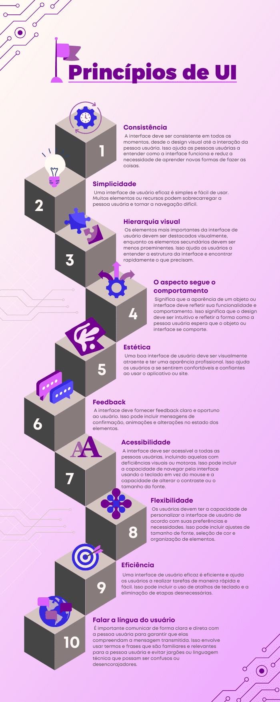

## Diferença entre UX e UI Design

Embora relacionados, o **UX Design** e o **UI Design** são duas áreas distintas, cada uma com seu foco específico. O **UX Design** concentra-se na experiência geral da pessoa usuária com um produto ou serviço. Ele se preocupa em compreender as necessidades, desejos e comportamentos das pessoas usuárias para criar uma experiência significativa e satisfatória. O **objetivo do UX Design** é garantir que o produto atenda às expectativas das pessoas usuárias, seja fácil de usar e forneça valor.

As pessoas especialistas em **UX Design** estão envolvidas em todas as etapas do processo de design, desde a pesquisa inicial do usuário, análise de requisitos, arquitetura de informação, criação de fluxos de usuário, prototipagem, testes de usabilidade e interação. Elas buscam entender os objetivos e as motivações das pessoas usuárias para criar soluções que atendam às suas necessidades.

O vídeo abaixo irá falar um pouco sobre o que é a experiência do usuário e qual a função de quem trabalha nesta área. Vale a pena conferir:

- ### [O que é UX?](https://www.youtube.com/watch?v=FJhMCi07T4A)

O **UI Design**, por outro lado, concentra-se na criação da interface visual e interativa com a qual os usuários interagem. É responsável por projetar a aparência visual, a disposição dos elementos, os ícones, as cores, a tipografia e a interação do usuário com a interface. O objetivo do **UI Design** é garantir que a interface seja esteticamente agradável, intuitiva e fácil de usar.

A pessoa **especialista em UI Design** trabalha na materialização das diretrizes de UX Design, traduzindo os requisitos e as soluções de UX em elementos visuais concretos. Elas criam layouts, definem a hierarquia visual, escolhem as cores e fontes adequadas, criam ícones e botões, e projetam interfaces visualmente atraentes, funcionais e acessíveis, para garantir uma experiência coesa e agradável.

Embora distintos, o **UX Design e o UI Design estão intimamente relacionados** e colaboram durante todo o processo de design. Um bom **UX Design** é essencial para entender as necessidades dos usuários e definir as funcionalidades e estrutura do produto, enquanto o **UI Design** é responsável por criar a interface visual que dá vida à experiência da pessoa usuária. Ambas as vertentes do Design são essenciais para criar produtos de alta qualidade.

## O que estudar primeiro?

Ao decidir se deve estudar UX ou UI Design primeiro, é importante compreender as diferenças e complementaridades entre essas áreas. Ambas são cruciais para a criação de produtos digitais bem sucedidos e agradáveis para as pessoas usuárias.

A escolha de qual área estudar depende de seus interesses e objetivos profissionais. Se você possui mais interesse em resolver problemas e melhorar a experiência da pessoa usuária com um produto, o UX Design pode ser uma escolha mais adequada. No entanto, se você sente mais interesse pela parte visual e interativa, o UI Design pode ser o caminho a seguir. Russ Unger, em seu livro “A Project Guide to UX Design” diz que o conhecimento em UX é fundamental para o UI, já que a experiência do usuário é a base para o design da interface. Nesse caso, começar pelo UX Design pode fornecer uma base sólida para entender as necessidades da pessoa usuária e como aplicá-las no design da interface. Porém, também é possível começar pelo UI Design e expandir seus conhecimentos para o UX posteriormente.

Vale ressaltar que ambas as áreas são importantes e complementares, e a escolha de qual estudar primeiro depende de seus interesses e objetivos profissionais. Independentemente da ordem escolhida, é essencial aprender continuamente e desenvolver habilidades em ambas as áreas para ter sucesso na área do Design de Produtos Digitais.

Compreender tanto a UX quanto a UI Design é essencial no Design de Produtos Digitais, já que ambas são cruciais para o desenvolvimento de produtos que atendam as necessidades das pessoas usuárias. É crucial entender que o aperfeiçoamento contínuo e o desenvolvimento de habilidades em ambas as áreas são fundamentais para obter sucesso na área de Design de Produtos Digitais. Por isso, é importante se atualizar sempre sobre ambas as áreas, para criar produtos digitais eficazes e atraentes.

## Macrointerações vs. Microinterações

No contexto atual em que vivemos, onde a tecnologia é uma parte integrante de nossas vidas diárias, é importante que as interfaces digitais sejam projetadas de maneira a atender às necessidades das pessoas usuárias e oferecer a melhor experiência possível. Daí surge a necessidade de entendermos o que são Macrointerações e Microinterações e como elas são importantes, pois ajudam a melhorar a usabilidade, a experiência da pessoa usuária e a eficácia geral do produto.

Para entendermos melhor, vamos imaginar um aplicativo de entrega de alimentos. Nele as microinterações serão usadas para melhorar a usabilidade da interface, como feedbacks visuais e sonoros quando um usuário faz um pedido ou escolhe uma opção de menu. As macrointerações, nesse caso, serão importantes para garantir que a pessoa usuária siga um fluxo lógico e intuitivo para concluir seu pedido, como um processo de checkout simples e intuitivo.

Outro exemplo pode ser um aplicativo de streaming de vídeo. As microinterações podem ser usadas para fornecer feedback visual quando a pessoa usuária pausa ou pula um vídeo, enquanto as macrointerações podem ser usadas para garantir que a pessoa usuária tenha uma experiência de visualização contínua, incluindo recomendações personalizadas e opções de pesquisa para encontrar conteúdo de interesse.

Então podemos destacar que as macrointerações podem ser entendidas como a "visão geral" da experiência do usuário, enquanto as microinterações são os detalhes que aprimoram essa experiência.

## O que faz um UI Designer?

A pessoa profissional em Design de Interface de Usuário, também conhecida como UI Designer, é responsável por planejar e projetar a estrutura de produtos digitais, como sites e aplicativos. Essa função envolve a **organização, construção visual, acessibilidade e fluxos de todo o produto, com o objetivo de atender às necessidades dos usuários e da empresa**.

Além disso, a pessoa UI Designer trabalha em colaboração com equipes multidisciplinares para criar designs, realizar testes e pesquisas, garantir a consistência da identidade visual dos produtos digitais de uma empresa e documentar o processo de desenvolvimento do produto/serviço em que estiver trabalhando.

As atividades mencionadas são comuns na rotina de uma pessoa UI Designer, embora outras possam surgir, dependendo das vagas disponíveis, projetos em desenvolvimento e demandas específicas de cada empresa.

O processo de trabalho da pessoa UI Designer pode ser dividido em várias etapas, que podem variar de acordo com o projeto e a área de atuação. Porém, é muito comum encontrarmos as seguintes etapas durante o desenvolvimento de um projeto:

- Entender o contexto do público que vai usar o sistema;
- Entender do negócio;
- Distribuir as informações em telas;
- Fazer um protótipo;
- Enviar o que foi feito para o time de desenvolvimento.

## Qual é a importância da atuação de uma pessoa UI Designer?

Conforme mencionado anteriormente, as pessoas não têm a obrigação de saber como utilizar um produto digital (aplicativo/site), e cabe à empresa ensiná-las e facilitar ao máximo o processo. A forma predominante de comunicação nesses produtos é a visual, com áudios, vídeos e muitos textos disponíveis. Se essa comunicação visual não for efetiva e acessível, todo o produto/serviço pode sofrer as consequências, pois os usuários não conseguirão utilizá-lo.

O trabalho da pessoa especializada em Design de Interface de Usuário (UI Designer) é justamente trabalhar na parte visual do produto ou serviço digital, garantindo que os usuários possam vivenciar a experiência completa sem encontrar barreiras. Ao fazer isso, há uma maior probabilidade de proteger os usuários de possíveis frustrações e, consequentemente, trazer mais sucesso ao investimento feito pela empresa no desenvolvimento do produto/serviço.

## Áreas de atuação

O UI é fundamental para o desenvolvimento de produtos digitais, pois é responsável por garantir que a experiência com as interfaces seja agradável, útil e acessível. No entanto, ao procurar oportunidades na área, é comum encontrar vagas de UI Design associadas à especialidade UX, o que significa que ter conhecimentos relacionados a User Experience (UX) pode ser importante para atuar na construção de interfaces.

A área de UI Design também é flexível em termos de tipos de contratação e regime de trabalho. Um UI Designer pode atuar como funcionário contratado com carteira assinada (CLT) ou como freelancer, além de ter a possibilidade de trabalhar presencialmente, em home office ou em um modelo híbrido (parte presencial e parte remota).

As **pessoas UI designers atuam em diversas áreas**, tanto em empresas específicas do setor de design quanto em outros setores comerciais e até **mesmo com front- end**. A principal característica desses profissionais é a elaboração de interfaces e layouts de diferentes formatos, proporcionando uma boa interação entre as pessoas usuárias e a máquina Algumas das áreas de atuação mais comuns incluem:

- Design de interfaces de aplicativos móveis;
- Design de interfaces para sites e sistemas web;
- Design de interfaces para softwares e programas de computador;
- Design de interfaces para jogos digitais;
- Design de interfaces para produtos de realidade virtual e aumentada;
- Design de interfaces para dispositivos eletrônicos, como smartwatches e assistentes de voz;
- Design de interfaces para sistemas de automação residencial ou industrial.

Além disso, uma pessoa UI Designer pode atuar em várias etapas do processo de desenvolvimento de produtos digitais, desde a concepção até a implementação, garantindo que a experiência a pessoas usuárias seja sempre levada em consideração e que o produto final seja fácil e agradável de usar.

Relação entre Motion Design e UI Design
A relação entre UI Design e Motion Design está na maneira como ambos contribuem para a experiência da pessoa usuária em interfaces digitais. Enquanto o UI Design foca na criação e organização de interfaces gráficas, o Motion Design utiliza animações e movimentos para melhorar a usabilidade, comunicação e experiência da pessoa usuária.

O Motion Design é uma técnica que combina princípios do design gráfico para a produção de vídeos ou animações, facilitando o entendimento e fixação de conteúdo. Issara Willenskomer, um especialista em usabilidade, define quatro campos em que o **Motion Design pode melhorar a usabilidade na experiência do usuário**: expectativa, continuidade, narrativa e relacionamento.

Ambas as vertentes do design podem trabalhar em conjunto para melhorar a experiência da pessoa usuária. O Motion Design pode ser incorporado ao UI Design para criar animações e movimentos que guiem a pessoa usuária, facilitem a navegação e comuniquem informações de forma mais eficiente e atraente.

Algumas aplicações práticas entre UI Design e Motion Design incluem:

1. **Animações de entrada e saída de elementos**: Essas animações podem melhorar a experiência da pessoa usuária, a tornando mais fluida e dinâmica. Por exemplo, um menu de navegação pode ter animações de deslizamento suave quando for acessado.

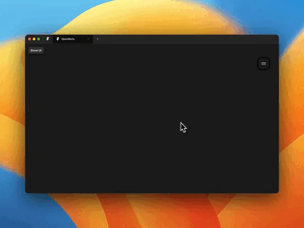

2. **Transições entre tela e tela**: Ao utilizar animações e transições suaves, a pessoa usuária percebe uma experiência mais agradável ao navegar pela aplicação. Por exemplo, uma transição de fade-in/fade-out pode ser usada para mudar de uma tela para outra.

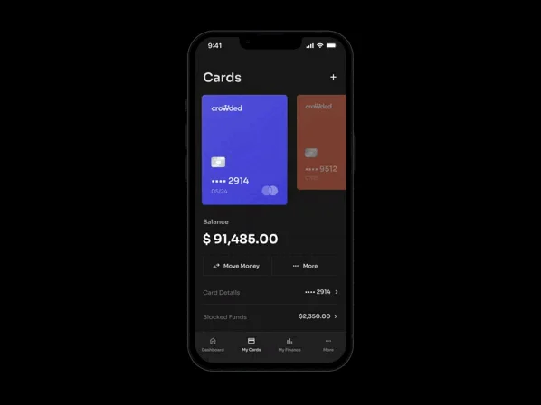

3. **Efeitos de zoom e ajuste**: Esses efeitos podem ser usados para destacar informações relevantes ou mostrar detalhes de um elemento específico na tela. Por exemplo, ao clicar em um ícone, o efeito de zoom pode ser aplicado para focar no conteúdo relacionado.

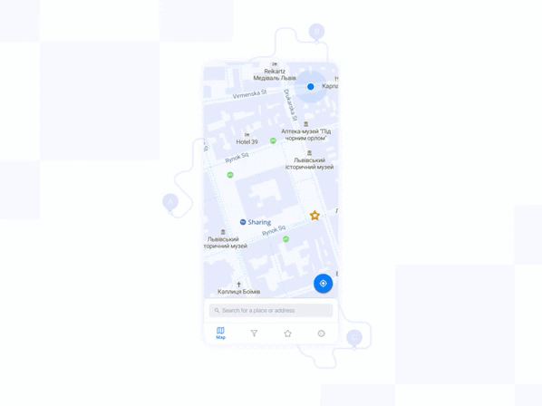

4. **Animações de feedback**: Ao inserir animações de feedback, como o movimento de um ícone quando o usuário clica nele, carregamento de uma barra de progresso ou o informando que algo foi um sucesso, a interação se torna mais intuitiva e agradável.

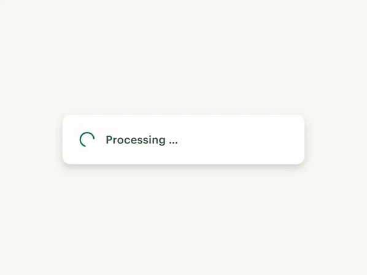

Em geral, tanto o UI Design quanto o Motion Design são partes importantes do processo de Design Digital e trabalham juntos para criar experiências visualmente impressionantes e fáceis de usar para as pessoas usuárias.

## Como se tornar um UI Design?

Se você deseja se tornar um UI Designer, existem algumas etapas que você pode seguir para começar a desenvolver as habilidades necessárias e investir em uma carreira na área.

### Descubra qual especialidade lhe interessa mais

Existem muitas áreas de design, por isso é importante descobrir qual delas você mais se interessa. No caso de UI Design, é uma mistura de interface e experiência.

### Estude as ferramentas

Dominar as ferramentas essenciais para um bom trabalho de UX/UI design é indispensável para que você desenvolva uma boa carreira como designer. Algumas ferramentas que podem ajudar nesse início são Figma e Adobe XD.

### Aprenda os princípios do UI Design

O UI Design tem princípios básicos que regem a atuação profissional, como cores, proporções, formas, entre outras questões. Entender mais sobre isso ajuda a pensar em interfaces mais agradáveis e que sejam capazes de captar a atenção do usuário. Para adquirir esse conhecimento, livros, artigos e todo material sobre design serão de grande ajuda.

### Fique de olho no mercado de trabalho

O mercado de trabalho para UI Designers é bastante aquecido e promete grandes projetos e vencimentos bastante competitivos. Além disso, existem muitas oportunidades de crescimento na carreira, tanto em empresas quanto como freelancer.

### Pratique

Com dedicação e prática é possível conquistar seu espaço na profissão. Depois de entender o conceito de UI Design, é hora de aprender sobre como colocar a mão na massa.

### Certificações

Para iniciar uma carreira em UI Design, é crucial ter vontade de aprender e estar constantemente se aprimorando. Possuir uma formação acadêmica em Design não é algo necessariamente obrigatório para muitas empresas, mas é recomendável buscar algum tipo de capacitação formal.

Atualmente, existem diversas opções disponíveis para aprender Design, desde a participação em cursos livres até a realização de uma graduação ou pós-graduação, há uma variedade de caminhos para aprimorar as habilidades nessa área. Essas diferentes modalidades de ensino oferecem oportunidades para adquirir conhecimentos teóricos e práticos.

Ter uma certificação também funciona como uma indicação de que você, como profissional, estudou e validou seus conhecimentos em uma determinada área do Design, o que pode enriquecer seu currículo. Algumas vagas de emprego podem exigir certificações específicas como requisitos, tornando-se um diferencial na seleção. Além disso, ter uma certificação demonstra comprometimento com a área e pode aumentar a confiança das pessoas empregadoras em suas habilidades e competências técnicas.

- ### [Vale a pena fazer uma certificação?](https://www.youtube.com/watch?v=IkPh53jDnwo)

## As principais habilidades de um UI Designer

Na área de UI Design, existem algumas habilidades que são necessárias para o sucesso profissional. As habilidades técnicas, também conhecidas como hard skills, referem-se às habilidades técnicas específicas da profissão, como conhecimento de ferramentas de design gráfico e de interface, bem como a capacidade de criar protótipos e designs de alta qualidade.

Já as habilidades comportamentais, também conhecidas como soft skills, incluem habilidades como comunicação, trabalho em equipe, liderança e resolução de problemas. Essas habilidades são igualmente importantes, pois os UI designers precisam interagir com outros profissionais, como desenvolvedores, gerentes de produto e stakeholders, além de trabalhar em projetos colaborativos.

É importante lembrar que as habilidades necessárias para ser uma pessoa especialista em UI Design podem variar dependendo da empresa ou do setor no qual você deseja trabalhar. Por exemplo, uma empresa de tecnologia pode dar mais importância para habilidades técnicas específicas, enquanto uma empresa de design pode priorizar habilidades criativas e conceituais. Por isso, é importante estar atento às demandas e requisitos específicos de cada vaga de emprego e se preparar adequadamente para esses desafios.

## As skills de um UI Designer

No infográfico abaixo podemos ver um pouco quais são as habilidades necessárias para um profissional de UI designer:

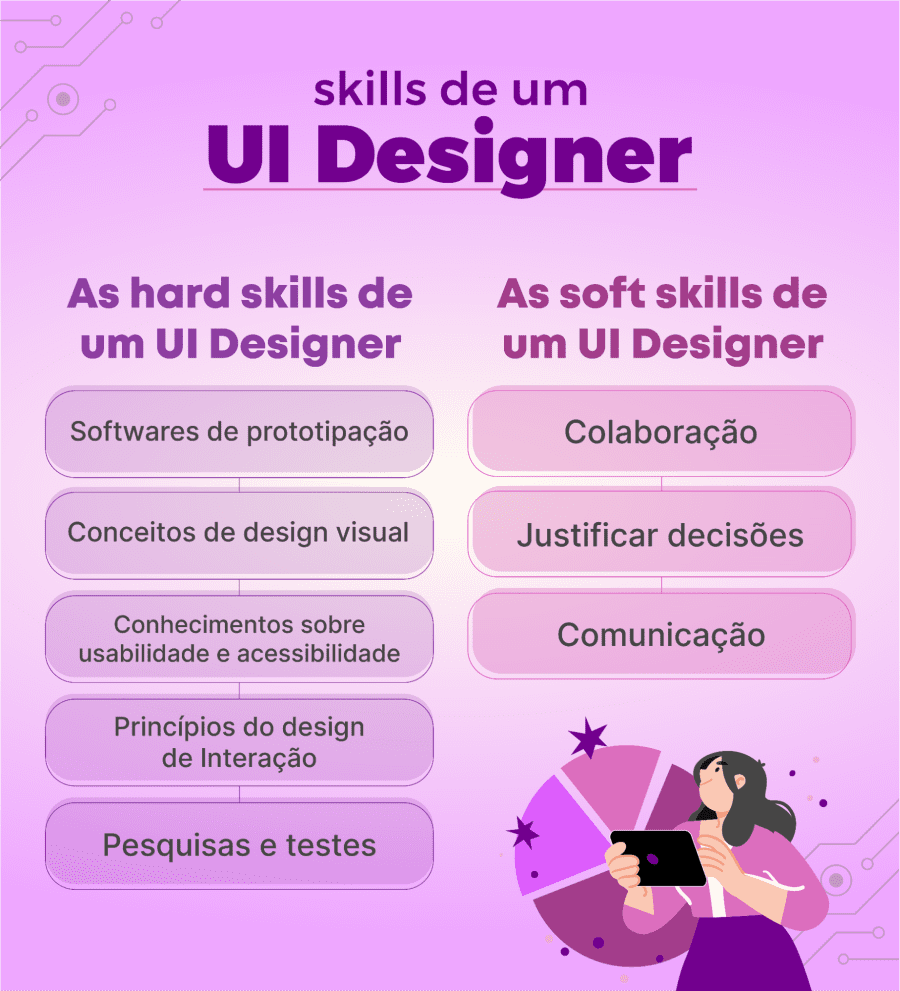

### As hard skills de um UI Designer

- **Softwares de prototipação**: É imprescindível que a pessoa UI designer saiba como utilizar esse tipo de aplicação. Alguns exemplos comuns são: Figma, Sketch, Adobe XD;

- **Conceitos de design visual**: O processo de construção de telas é uma tarefa que utiliza muitos conceitos teóricos e práticos do design visual, ou seja, teoria das cores, formas, harmonização, grids etc;

- **Conhecimentos sobre usabilidade e acessibilidade**: Um produto digital só tem valor se for útil e se o público conseguir viver a experiência sem barreiras;

- **Princípios do Design de Interação**: Uma das responsabilidades da pessoa UI Designer é projetar todo o caminho que as pessoas usuárias seguirão através das telas e como o fluxo acontecerá. Esse processo é chamado de Design de Interação;

- **Pesquisa e testes**: Muitas vezes você precisará testar os seus protótipos para garantir que o produto está funcionando da forma que deveria, e identificar possíveis pontos de melhoria que só poderiam ser encontrados em uma experiência mais prática.

### As soft skills de um UI Designer

- **Colaboração**: Uma pessoa UI Designer precisa saber como conviver com outras pessoas e desempenhar tarefas junto a elas diariamente, pois seu trabalho é muitas vezes feito em equipe;

- **Justificar decisões**: nem sempre as suas ideias serão aceitas logo de início, então, como a pessoa especialista responsável por garantir a experiência da pessoa usuária, é sua responsabilidade utilizar seus conhecimentos sobre a área para defender as decisões tomadas. Mas cuidado: tenha também a humildade de entender quando sua ideia de fato não estiver funcionando e for necessário fazer alterações;

- **Comunicação**: conversar com as pessoas em grandes e pequenas reuniões, trocar informações diretamente com colegas ou até mesmo participar de atividades indiretamente ligadas a sua função são alguns exemplos de tarefas que são muito comuns no dia a dia de uma pessoa UI Designer.

## Quais são as principais ferramentas de UI?

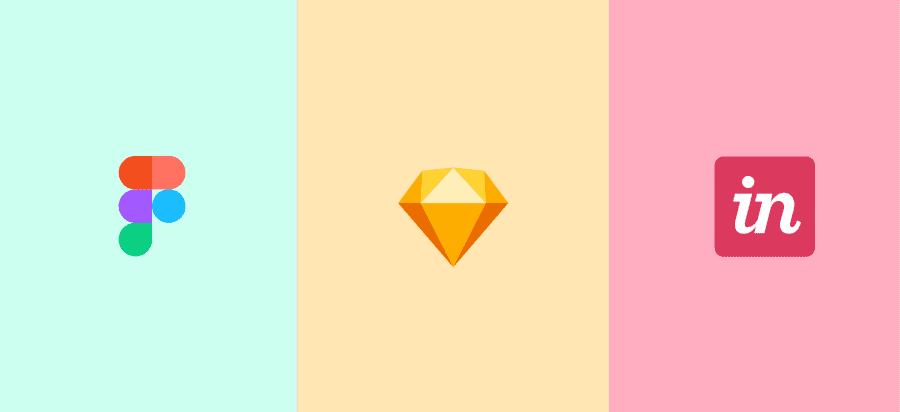

Vimos que para nos tornarmos profissionais em UI Design precisamos ter algumas habilidades essenciais e uma delas é conseguir utilizar algumas ferramentas de prototipação e organização, para que consigamos criar o visual de um produto digital e compartilhar o resultado com a equipe. Algumas das principais ferramentas para UI designers são:

- **Figma**: é uma ferramenta baseada em nuvem que ajuda as pessoas a trabalharem simultaneamente em um determinado projeto. Possui recursos de prototipagem, criação de componentes, compartilhamento de designs e muitos recursos úteis, além de permitir projetar interfaces completas;

- **Sketch**: é uma ferramenta que ajuda a projetar interfaces de maneira rápida e intuitiva. O Sketch fornece uma solução completa, desde os desenhos iniciais ao protótipo, até o compartilhamento das telas para a pessoa desenvolvedora. Está disponível apenas para Mac e é uma das ferramentas mais sofisticadas e procuradas para o UI;

- **InVision Studio**: é uma ferramenta que tem a capacidade de converter rapidamente telas estáticas em protótipos interativos clicáveis, completos com transições e animações. O Invision se integra ao Sketch, com recursos de colaboração de projeto, que permitem a todos os usuários dar feedback, fazer anotações e ver as alterações do produto em tempo real.

## Dicas práticas de UI design

O UI desempenha um papel fundamental na criação de experiências digitais agradáveis e eficazes para as pessoas usuárias. Ao projetar uma interface, é essencial considerar diversos fatores, como a usabilidade, a estética visual e a capacidade de fornecer uma experiência intuitiva. Algumas dicas para desenvolver um bom UI são:

- **Compreender o público-alvo**: isso envolve conhecer as características demográficas, comportamentais e as necessidades das pessoas usuárias;

- **Simplicidade**: uma interface limpa e organizada torna mais fácil para quem utiliza o produto, compreender e navegar no sistema;

- **Hierarquia visual**: destacar elementos-chave, como títulos e chamadas para ação, ajuda as pessoas usuárias a entenderem a importância e a sequência das informações apresentadas;

- **Grids e alinhamento**: contribuem para uma interface organizada e visualmente agradável;

- **Usabilidade móvel**: é fundamental para atender às necessidades dos usuários que acessam os sistemas por meio de smartphones e tablets;

- **Realizar testes de usabilidade**: permite identificar problemas, pontos de atrito e áreas de melhoria na interface, garantindo que ela atenda às necessidades e expectativas das pessoas usuárias.

Além disso tudo, **se atualizar** sobre as tendências, as melhores práticas e as novas tecnologias é essencial para criar interfaces envolventes. 

## Como ter um portfólio

Ter um portfólio é uma maneira eficaz de mostrar suas habilidades e experiência em design de interface de usuário para potenciais empregadores ou clientes. Para isso, vale destacar os seguintes pontos para ter um portfólio em UI Design:

- **Escolha o tipo de portfólio**: online, impresso ou em PDF. Cada opção tem suas vantagens específicas, e é recomendado que você tenha um portfólio de cada tipo. O portfólio online, por exemplo, permite que qualquer pessoa encontre o trabalho do profissional na internet, enquanto o impresso é uma boa opção para reuniões presenciais;

- **Selecione os melhores trabalhos**: é importante escolher as peças que vão melhor representar o seu potencial. Para isso, é preciso fazer uma observação minuciosa de todo o conjunto das obras que você já realizou;

- **Manutenção e atualização do portfólio**: é importante manter o portfólio atualizado com projetos novos que foram produzidos no decorrer da vida profissional. Os clientes precisam e querem novidades, e ao atualizar o portfólio, você tem a chance de atribuir valor ao seu trabalho;

- **Mostrar profissionalismo**: um portfólio bem estruturado e com clareza de informações ajuda o aspirante a uma vaga a demonstrar não só profissionalismo, mas também diferencial competitivo;

- **Ser transparente ao demonstrar conhecimento em UI Design**: na hora de apresentar o portfólio, o cliente potencial precisa saber qual o nível de experiência do profissional. É importante ressaltar outros pontos dos projetos passados, como as habilidades interpessoais e as estratégias e procedimentos feitos com a equipe;

- **Destaque suas habilidades técnicas**: Se você possui conhecimentos em ferramentas específicas de design de UI, mencione-as em seu portfólio. Isso pode incluir ferramentas como Adobe XD, Sketch, Figma, InVision ou qualquer outra ferramenta relevante para o seu trabalho;

- **Compartilhe seu portfólio**: Depois de criar seu portfólio, compartilhe-o com potenciais empregadores, clientes ou em plataformas de portfólio online. Certifique-se de que seja facilmente acessível e compartilhe o link em seu currículo e em perfis profissionais, como LinkedIn e Behance.

Lembre-se de que a qualidade do seu trabalho e a apresentação do seu portfólio são essenciais para impressionar os recrutadores ou clientes. Não esqueça de que seu portfólio é uma representação fiel das suas habilidades e interesse por UI.

No curso **Design Visual: estratégias para planejar e construir seu portfólio** você irá aprender a elaborar um portfólio em design e conhecer os princípios fundamentais para construção de um portfólio. Além disso, o nosso instrutor traz várias dicas para montagem de portfólios de design gráfico, UI, UX, vídeo, motion e animação.